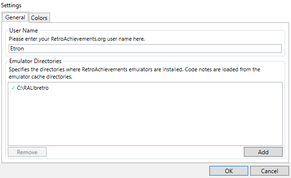
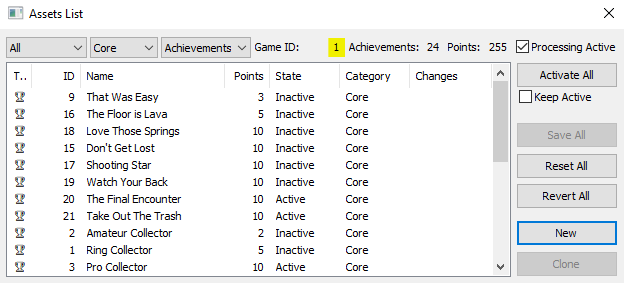
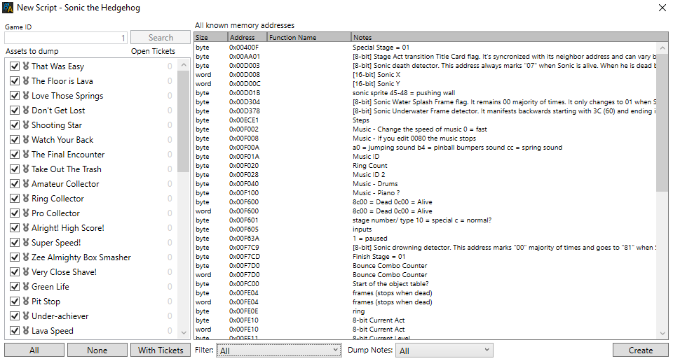
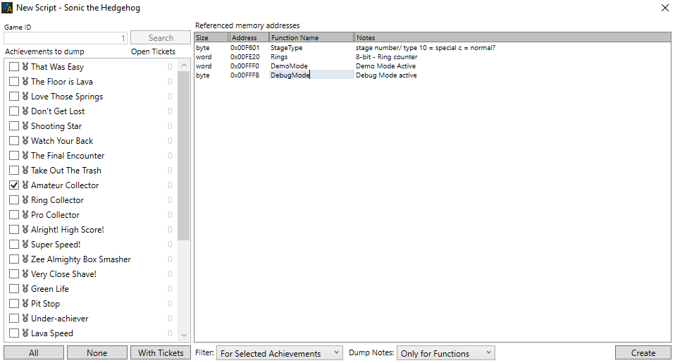

# Tutorial #0 - Getting Started
## Why Use RAScripts?
You may be wondering why the effort of learning a new language to make achievements when you can already code it directly in the GUI?  Below is a non-exhaustive list of benefits of learning RAScripts.
### Improved Readability
With RAScripts you can name memory locations and special values making it easier to understand what’s going on at a glance.  You might not remember what memory location 0x075e does however you’ll instantly know what the function Coins() means.

### Code Quicker with Less Errors
RAScripts excel at creating many similar slightly varying achievements quickly and without mistakes. No more copy and paste errors. 

### More Complicated Achievements
Using arrays and loops you can create complex achievements that would be tedious to do by hand.  Got a big idea but not sure how to code it? RAScripts can help do the heavy lifting!

### Easier to Maintain
It’s easy to update and change a set written in RAScripts.  Need to add or update save protection for every achievement in a set? A well written RAScript will make small edits to many achievements much easier.

### Test Achievements
Quickly create test achievements to help better understand a game.  Record important details as you play like level transitions, high scores, speed run times, and enemy kill counts. Curious how a game mechanic works or what a reasonable achievement goal should be? A script of test achievements will help answer those questions.

### Updating Existing Sets
RATools can import code from sets in the core.  Using the import process to name memory addresses in the code which makes it easier to update, add rich presence, and leaderboards to existing sets.

## Getting the Right Tools
Before you start scripting you will need to download the newest release of [RATools](https://github.com/Jamiras/RATools/releases). The program needs a little setup before you can use it:
1) Open the settings menu by clicking on *File -> Settings…*
2) Enter your in name in the *User Name* textbox
3) Click **Add** and browse to the file location of RALibRetro. The icon next to the file location will change to a green checkmark if the emulator was correctly detected.
4) (Optional) Click on the *Colors* tab and click on the **Dark Theme** button.
5) Press the **OK** button at the bottom of the screen.<br>

 
## Importing Code
When first learning RAScripts it can be a little daunting to know where to start.  One good method of learning how to write scripts is to import existing achievements into RATools.  This tutorial will focus on how to import a script into RATools, how to clean up the script if necessary, and how to update changes back in to RALibRetro. There are several cases were you would want to import code with RATools:<br>
* Learning how to code a specific achievement
* Fixing tickets
* Converting existing code to an RAScript
* Creating Rich Presences and/or Leaderboards<br>
### Importing Code Steps
If you are just learning RAScripts then it is extremely useful to import a set your familiar with to see how it looks in script form. To import a new script:<br>
1) Load and play a game in RALibRetro (or any of the RA emulators that support editing achievements).  You only need to start playing the game which will trigger downloading the necessary achievement data to the RACache folder.
2) Record the game id number which can be found on the top of the menu item *RetroAchievements -> Asset List*.  For this example we will be looking at Sonic the Hedgehog which is game id 1.<br>

 
3) Open RATools and click on the menu item *File -> New Script*
4) Enter the *Game ID* number in the top left and press the **Search** button
5) All of the achievements, rich presence, and leaderboards will show up on the left panel and all of the game notes will show up on the right.
6) Add a checkmark next to the achievements you want to import and select how you want to filter code notes.  When in doubt use All for both the Filter and Dump Notes so that all of the code notes will be included in the new script.
7) Press the **Create** button to have RATools generate the script<br>

## Cleaning up Code
When you import a new script, RATools will generate scripts with the memory addresses and values. Below is an example of what the achievement “Amateur Collector” looks like when imported.
```fsharp
achievement(
    title = "Amateur Collector", description = "Collect 20 Rings", points = 2,
    id = 2, badge = "00199", published = "2012-11-02 12:03:12 AM", modified = "2021-03-01 5:48:45 PM",
    trigger = word(0x00FE20) >= 20 && word(0x00FFF0) == 0 && byte(0x00FFFB) == 0 && byte(0x00F601) == 12
)
```
To make the script easier to understand and maintain it is recommended that you replace the memory address with functions. By using the **Function** column on the *Referenced Memory Addresses* panel you can specify a function name for each address in the code notes.  These functions will replace the memory address when the code is generated. In the below example we import the same achievement and give a name to each memory function used.<br>


```fsharp
// Sonic the Hedgehog
// #ID = 1

// $F601: stage number/ type
//        10 = special
//        c = normal?
function StageType() => byte(0x00F601)

// $FE20: 8-bit - Ring counter
function Rings() => word(0x00FE20)

// $FFF0: Demo Mode Active
function DemoMode() => word(0x00FFF0)

// $FFFB: Debug Mode active
function DebugMode() => byte(0x00FFFB)

achievement(
    title = "Amateur Collector", description = "Collect 20 Rings", points = 2,
    id = 2, badge = "00199", published = "11/2/2012 12:03:12 AM", modified = "3/1/2021 5:48:45 PM",
    trigger = Rings() >= 20 && DemoMode() == 0 && DebugMode() == 0 && StageType() == 12
)
```
Notice how you can easily read the above function and understand what is going on.  By entering function names while importing any achievement that uses the memory word(0x00FE20) will now reference Rings() for example. The next step would be to use functions for similar types of achievements.  For example, the above ring collecting achievement has a 100 and 200 rings variation where the only difference is the number of rings to collect.  There is an example of how to make a function for this type of achievement in [Example 1A](../01_Memory/Example_1A.md).
## Comparing Code
If you wish to see how the script changes you made compare to what’s in the core then select the achievement from the list on the left panel. A filled in circle next to an achievement indicates that it is new and does not exist in core, a half circle indicates the achievement has changed from the core, and a hollow circle means that the script matches the core. Lines added by the script will be colored green and lines remove will be colored red. To get back to the code view, click on the script name at the top left. Note that RATools has some optimizations built in so it will automatically improve existing code.  The example below shows such a case where the optimizations has made the code cleaner although no changes were made in the script.<br>

## Updating Code
Once you are ready to test you can export the updated code back into RALibRetro with *Edit -> Update Local*.  Note that the script must be error free to proceed with the update. Select all of the achievements you wish to update and press the **OK** button.  Your new updates will appear next time you open RALibRetro. If RALibRetro was open during the update you’ll need to select the achievements that were updated and press the **Reset** button to reload them from the local cache.
## Homework
1. Import an existing game in to RATools.
2. Pick an achievement and import it in to RATools replacing the memory addresses  with functions.
3. Make a small change to an achievement and use the compare panel to see what the change looks like.