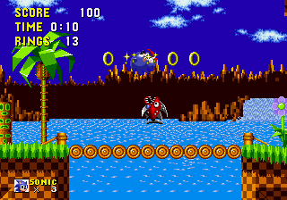
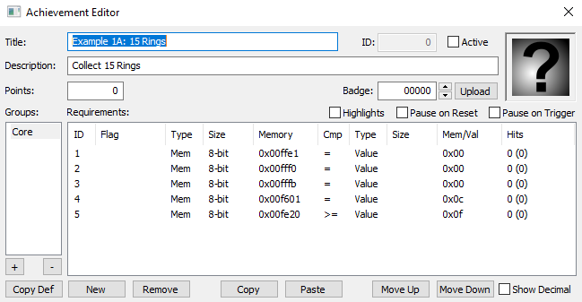

## Example 1A - Counting Rings
Rings are the main object which Sonic collects and Sonic gets a life for every 100 rings accumulated. The memory for rings is a byte which makes it easy to check when the value of the rings goes above a certain threshold. To make sure that the player is not watching the demo or cheating the following code adds the Active() and InNormalStage() functions to the trigger condition.



```
// Create an achievement for when the player collects X rings
function CollectRings(count)
{
    achievement(
        title = "Example 1A: " + count + " Rings",
        description = "Collect " + count + " Rings",
        points = 0,
        trigger = Active() && 
            InNormalStage() &&
            Rings >= count
    )
}

// Create 3 tiered achievements for collecting rings
CollectRings(15)
CollectRings(100)
CollectRings(200)
```

### Example Translation
To help understand how this script is compiled by RATools we will dissect it step by step until we get to the code used in RALibRetro.  Note that this might not be the exact steps the compiler takes however, it should give you a good picture of how the script is interpreted. We’ll use the function to collect 15 rings as an example.  The compiler will use the same process for each of the achievement functions.
 ```
CollectRings(15)
```
Being a function the compiler will jump to CollectRings() and use 15 in place of the parameter *count*.
```
achievement(
    title = "Example 1A: 15 Rings",
    description = "Collect 15 Rings",
    points = 0,
    trigger = Active() && 
        InNormalStage() &&
        Rings >= 15
)
```
Next the compiler will jump to the functions Active() then InNormalStage() which would be the equivalent of writing.
```
achievement(
    title = "Example 1A: 15 Rings",
    description = "Collect 15 Rings",
    points = 0,
    trigger = LevelSelect == 0 &&
        DemoMode == 0 &&
        DebugMode == 0 && 
        StageType == 0xC &&
        Rings >= 15
)
```
Finally the variables would be replaced with the actual memory addresses.
```
achievement(
    title = "Example 1A: 15 Rings",
    description = "Collect 15 Rings",
    points = 0,
    trigger = byte(0xFFE1)  == 0 &&
        byte(0xFFF0) == 0 &&
        byte(0xFFFB)== 0 && 
        byte(0xF601) == 0xC &&
        byte(0xFE20) >= 15
)
```
Even though the above code is equivalent to what we started with, it would be more difficult to understand what is going on if it was written like this.  Now that we are down to checking memory locations and values, the code can be converted into something that RALibRetro would understand.
\
\
Links:\
[Tutorial #1](readme.md)\
Example 1A\
[Example 1B](Example_1B.md)\
[Example 1C](Example_1C.md)