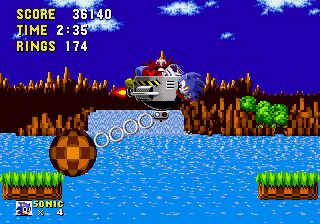

## Example 1B - Level Transitions
Sonic the Hedgehog is divided into seven zones each with three acts (except the final zone which is an end game boss battle).  It appears that the developers changed around the order of the zones and acts since they are non-sequential.  This means we need to know the last and next level id to detect a level transition. Note that in the code below, a series of variables are declared for each level in the game.  That way when we are looking for a level transition we can use the name of the level rather than needing to know the id value.



```
// Shortcut variables for each level
GreenHillZoneAct1 = 0x0000
GreenHillZoneAct2 = 0x0001
GreenHillZoneAct3 = 0x0002
MarbleZoneAct1 = 0x0200
MarbleZoneAct2 = 0x0201
MarbleZoneAct3 = 0x0202
SpringYardZoneAct1 = 0x0400
SpringYardZoneAct2 = 0x0401
SpringYardZoneAct3 = 0x0402
LabyrinthZoneAct1 = 0x0100
LabyrinthZoneAct2 = 0x0101
LabyrinthZoneAct3 = 0x0102
StarLightZoneAct1 = 0x0300
StarLightZoneAct2 = 0x0301
StarLightZoneAct3 = 0x0302
ScrapBrainZoneAct1 = 0x0500
ScrapBrainZoneAct2 = 0x0501
ScrapBrainZoneAct3 = 0x0103
FinalZone = 0x0502
EndGame = 0x0601

// Create an achievement for when the player transitions between levels
function ZoneComplete(zone, last, next)
{
    achievement(
        title = "Example 1B: " + zone,
        description = "Complete " + zone,
        points = 0,
        trigger = Active() && Transition(last, next)
    )
}

// Create all of the progression achievements
ZoneComplete("Green Hill Zone", GreenHillZoneAct3, MarbleZoneAct1)
ZoneComplete("Marble Zone", MarbleZoneAct3, SpringYardZoneAct1)
ZoneComplete("Spring Yard Zone", SpringYardZoneAct3, LabyrinthZoneAct1)
ZoneComplete("Labyrinth Zone", LabyrinthZoneAct3, StarLightZoneAct1)
ZoneComplete("Star Light Zone", StarLightZoneAct3, ScrapBrainZoneAct1)
ZoneComplete("Scrap Brain Zone", ScrapBrainZoneAct3, FinalZone)
ZoneComplete("Final Zone", FinalZone, EndGame)
```
### Example Translation
Like the previous example let’s dissect one of the achievement functions step by step until we get to the code used in RALibRetro.
```
ZoneComplete("Green Hill Zone", GreenHillZoneAct3, MarbleZoneAct1)
```
Being a function the compiler will jump to the ZoneComplete() function and use *zone* = "Green Hill Zone", *last* = GreenHillZoneAct3, and *next* = MarbleZoneAct1 for the parameter values.
```
achievement(
    title = "Example 1B: Green Hill Zone",
    description = "Complete Green Hill Zone",
    points = 0,
    trigger = Active() && Transition(GreenHillZoneAct3, MarbleZoneAct1)
)
```
Now let’s replace Active() and the Transition() functions with the parameters *last* = GreenHillZoneAct3 and *next* = MarbleZoneAct1.
```
achievement(
    title = "Example 1B: Green Hill Zone",
    description = "Complete Green Hill Zone",
    points = 0,
    trigger = LevelSelect == 0 &&
        DemoMode == 0 &&
        DebugMode == 0 &&
        prev(Level) == GreenHillZoneAct3 && 
        Level == MarbleZoneAct1
)
```
Finally the variables are replaced with the actual memory addresses and values.
```
achievement(
    title = "Example 1B: Green Hill Zone",
    description = "Complete Green Hill Zone",
    points = 0,
    trigger = byte(0xFFE1) == 0 &&
        byte(0xFFF0) == 0 &&
        byte(0xFFFB) == 0 &&
        prev(word(0xFE10)) == 0x0002 && 
        word(0xFE10)== 0x0200
)
```
Here’s how the achievement looks in RALibRetro.
\
\
Links:\
[Tutorial #1](readme.md)\
[Example 1A](Example_1A.md)\
Example 1B\
[Example 1C](Example_1C.md)