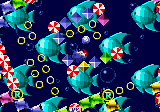

## Example 1C - Collect Chaos Emeralds
The Chaos Emeralds are rare collection items and you need to collect all six to get the best ending.  You get an opportunity to collect a chaos emerald in each of the six special stages. To get to a special stage you need to complete a non-boss act with 50 or more rings. Doing so will make a giant warp ring appear at the end of the act which you can jump in to go to one of the special stages.



### Homework 1
A)  Using the memory addresses provided in this example make a function that can generate achievements for collecting each chaos emerald.\
B)  Using the same method as Example 1A and 1B dissect one of the achievement functions step by step until all the variables and functions are removed.\
\
The following variables have been created to help with figuring out which emerald is in which special stage.
```
SpecialStageWhiteEmerald = 0
SpecialStageBlueEmerald = 1
SpecialStageYellowEmerald = 2
SpecialStagePurpleEmerald = 3
SpecialStageGreenEmerald = 4
SpecialStageRedEmerald = 5
```
[Tutorial #1 Solution](Solution/readme.md)\
\
Links:\
[Tutorial #1](readme.md)\
[Example 1A](Example_1A.md)\
[Example 1B](Example_1B.md)\
Example 1C