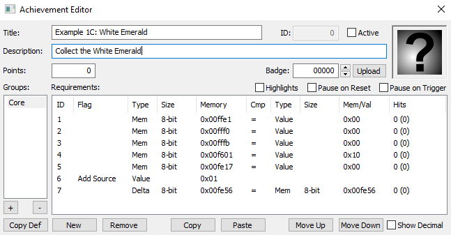

# Tutorial #1 Solution
## Solution A
The below script is a possible solution to the achievements for collecting chaos emeralds. This solution uses the current special stage number to determine which emerald was obtained when the number of emeralds increments by one.  The line prev(ChaosEmeralds) < ChaosEmeralds could also have been used with the same results.
```
SpecialStageWhiteEmerald = 0
SpecialStageBlueEmerald = 1
SpecialStageYellowEmerald = 2
SpecialStagePurpleEmerald = 3
SpecialStageGreenEmerald = 4
SpecialStageRedEmerald = 5

function ChaosEmeraldCollected(color, stage)
{
    achievement(
        title = "Example 1C: " + color + " Emerald",
        description = "Collect the " + color + " Emerald",
        points = 0,
        trigger = Active() && 
            InSpecialStage() &&
            SpecialStage == stage &&
            prev(ChaosEmeralds) + 1 == ChaosEmeralds
    )
}

ChaosEmeraldCollected("White", SpecialStageWhiteEmerald)
ChaosEmeraldCollected("Blue", SpecialStageBlueEmerald)
ChaosEmeraldCollected("Yellow", SpecialStageYellowEmerald)
ChaosEmeraldCollected("Purple", SpecialStagePurpleEmerald)
ChaosEmeraldCollected("Green", SpecialStageGreenEmerald)
ChaosEmeraldCollected("Red", SpecialStageRedEmerald)
```
## Solution B
Let’s dissect the white emerald achievement function step by step until we get to the code used in RALibRetro.
```
ChaosEmeraldCollected("White", SpecialStageWhiteEmerald)
```
The compiler will jump to the ChaosEmeraldCollected() function and use the parameters *color* = "White" and *stage* = SpecialStageWhiteEmerald.
```
achievement(
    title = "Example 1C: White Emerald",
    description = "Collect the White Emerald",
    points = 0,
    trigger = Active() && 
        InSpecialStage() &&
        SpecialStage == SpecialStageWhiteEmerald &&
        prev(ChaosEmeralds) + 1 == ChaosEmeralds
)
```
Now let’s replace the Active() and the InSpecialStage() functions
```
achievement(
    title = "Example 1C: White Emerald",
    description = "Collect the White Emerald",
    points = 0,
    trigger = LevelSelect == 0 &&
        DemoMode == 0 &&
        DebugMode == 0 &&
        StageType == 0x10 &&
        SpecialStage == SpecialStageWhiteEmerald &&
        prev(ChaosEmeralds) + 1 == ChaosEmeralds
)
```
Finally the variables are replaced with the actual memory addresses and values.
```
achievement(
    title = "Example 1C: White Emerald",
    description = "Collect the White Emerald",
    points = 0,
    trigger = byte(0xFFE1) == 0 &&
        byte(0xFFF0) == 0 &&
        byte(0xFFFB) == 0 &&
        byte(0xF601) == 0x10 &&
        byte(0xFE17) == 0 &&
        prev(byte(0xFE56)) + 1 == byte(0xFE56)
)
```
Here’s how the achievement looks in RALibRetro.\
\
\
[Complete script with the above solution](Example_01_Sonic_the_Hedgehog_Solution.rascript)
\
Links:\
[Tutorial #1](../readme.md)\
[Example 1A](../Example_1A.md)\
[Example 1B](../Example_1B.md)\
[Example 1C](../Example_1C.md)