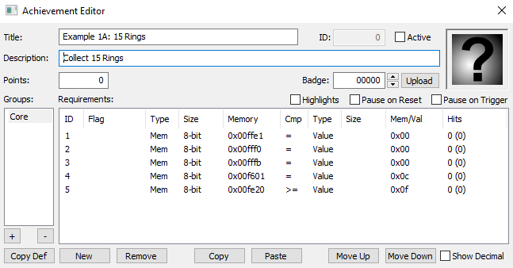

# Tutorial 1 - Memory Basics
## Overview
This tutorial will show a few examples of how to use both variables and functions to create some basic achievements in RAScript.  [Sonic the Hedgehog](https://retroachievements.org/game/1) was chosen for the example due to its simple memory and since it is such a well know title.  The [example script](Example_01_Sonic_the_Hedgehog.rascript) will used to highlight aspects of the tutorial.
Note that this tutorial will touch on some programming fundamentals but will not go in to depth.  If you are new to the programming world there several free sites online that would be a good introduction.  This series of tutorials will use video links from [Khan Academy](https://www.khanacademy.org/) to help explain programming basics where appropriate. 
## Variables
Variables are abstract data elements that allow the programmer to store and manipulate different types of data.  As a programmer you can create and manipulate variable as needed. If you are unfamiliar with the concept of variables then review [Variables](https://www.khanacademy.org/computing/computer-programming/programming/variables/pt/intro-to-variables) and [More on Variables](https://www.khanacademy.org/computing/computer-programming/programming/variables/pt/more-on-variables) videos from Khan Academy.

In RAScripts a variable can be:
* Integers - Whole numbers that range from -2147483648 to 2147483647
* Floats - Real numbers that range from -3.4E+38 to +3.4E+38
* Strings - Text values that are surrounded by quotation marks 
* Conditions - Binary logical expressions that yield true or false values.  Achievement logic are conditions and the achievement is triggered when all of the conditions are true.
* Arrays – Arrays are sequential memory that can be indexed by an integer. Arrays are commonly used with for loops and will be covered there.
* Dictionaries – Dictionaries are memory that can be indexed by either an integer or string using hash maps. Dictionaries are commonly used with rich presence and will be covered there.

The following code is using variables to abstract memory locations with easy to understand names.  For example, it’s much easier to understand what the variable *Rings* is used for instead of *byte(0xFE20)*. One major point is that variables must be declared before you use them so many scripts declare variables right at the beginning.
```
// $F601: [8-bit] Stage type
//        0x10 = special
//        0x0C = normal?
StageType = byte(0xF601)

// $FE10: [16-bit] Current Act and Zone Together
Level = word(0xFE10)

// $FE17: [8-bit] Current special stage
//        0 = White Emerald
//        1 = Blue Emerald
//        2 = Yellow Emerald
//        3 = Purple Emerald
//        4 = Green Emerald
//        5 = Red Emerald
SpecialStage = byte(0xFE17)

// $FE20: [8-bit] Ring counter
Rings = byte(0xFE20)

// $FE56: [8-bit] Chaos Emeralds Count (range 0-6)
ChaosEmeralds = byte(0xFE56)

// $FFE1: [8-bit] Level Select Active (0 = not active)
LevelSelect = byte(0xFFE1)

// $FFF0: [8-bit] Demo Mode Active (0 = not active)
DemoMode = byte(0xFFF0)

// $FFFB: [8-bit] Debug Mode active (0 = not active)
DebugMode = byte(0xFFFB)
```
## Functions
Function are modules of code that can be reused as many times as needed. If you find yourself writing a repetitive piece of code it would often be better written as a function.  When you call a function all of the code inside of the function is ran returning a result variable once done. If you are unfamiliar with the concept of functions then review the [Functions](https://www.khanacademy.org/computing/computer-programming/programming/functions/pt/functions), [Function Parameters](https://www.khanacademy.org/computing/computer-programming/programming/functions/pt/function-parameters), and [Function Return Values]( https://www.khanacademy.org/computing/computer-programming/programming/functions/pt/function-return-values) videos from Khan Academy.
Like variables, functions need to be declared before they are called so this example defines the following functions after the memory variables are defined. We define some helper functions that help further abstract the code from the raw memory address and values which help make it easier to understand.  These helper functions will be used later in the example.
```
// Check if we are in a normal stage
function InNormalStage() => StageType == 0xC

// Check if we are in a special stage
function InSpecialStage() => StageType == 0x10

// Check for the transition between two levels
function Transition(last, next) => prev(Level) == last && Level == next

// The Active function handles the level select, debug, and demo checks.
// This function should be added to each achievement for cheat protection
function Active()
{
    return LevelSelect == 0 &&
        DemoMode == 0 &&
        DebugMode == 0
}
```

The InNormalStage() and InSpecialStage() are used as shortcuts that return a condition to check if player is currently in a normal stage or a special stage. The Active() function returns a more complicated condition that handles the demo and cheat protection for the set.  The benefit of wrapping up all of the protection conditions in one function is that if new type of protection was needed then you could simply update the Active() function and each achievement will get updated with the new protection.

The Transition() function is unique since it takes the parameters *last* and *next* which change how the function operates.  You can use the parameters inside a function like variables that only exist inside of the function.  In this case the function checks if previous (delta) value of the level is the *last* value and current value of the level is the *next* value.  A different condition will be created depending on the parameters were used.
## Example 1A - Counting Rings
Rings are the main object that Sonic collects and Sonic gets a life for every 100 rings accumulated. The memory for rings is a byte making it easy to check when the value of the rings goes above a certain threshold. To make sure that the player is not watching the demo or cheating the follow code uses the Active() and InNormalStage() functions to the trigger condition.
```
// Create an achievement for when the player collects X rings
function CollectRings(count)
{
    achievement(
        title = "Example 1A: " + count + " Rings",
        description = "Collect " + count + " Rings",
        points = 0,
        trigger = Active() && 
            InNormalStage() &&
            Rings >= count
    )
}

// Create 3 tiered achievements for collecting rings
CollectRings(15)
CollectRings(100)
CollectRings(200)
```

### Example Translation
To help understand how this script is compiled by RATools we will dissect it step by step until we get to the code used in RALibRetro.  Note that this might not be the exact steps the compiler takes however, it should give you a good picture of how the script is interpreted. We’ll use the function to collect 15 rings as an example.  The compiler will use the same process for each of the achievement functions.
 ```
CollectRings(15)
```
Being a function the compiler will jump to the CollectRings function and use 15 in place of the parameter *count*.
```
achievement(
	title = "Example 1A: 15 Rings",
	description = "Collect 15 Rings",
	points = 0,
	trigger = Active() && 
		InNormalStage() &&
		Rings >= 15
)
```
Next the compiler will jump to the functions Active() then InNormalStage() which would be the equivalent of writing.
```
achievement(
	title = "Example 1A: 15 Rings",
	description = "Collect 15 Rings",
	points = 0,
	trigger = LevelSelect == 0 &&
		DemoMode == 0 &&
		DebugMode == 0 && 
		StageType == 0xC &&
		Rings >= 15
)
```
Finally the variables would be replaced with the actual memory addresses.
```
achievement(
	title = "Example 1A: 15 Rings",
	description = "Collect 15 Rings",
	points = 0,
	trigger = byte(0xFFE1)  == 0 &&
		byte(0xFFF0) == 0 &&
		byte(0xFFFB)== 0 && 
		byte(0xF601) == 0xC &&
		byte(0xFE20) >= 15
)
```
Even through the above code is equivalent to what we started with, it would be more difficult to understand what is going on if it was written like this.  Now that we are down to checking memory location and values the code be can converted into something that RALibRetro would understand.

 

## Example 1B - Level Transitions
Sonic the Hedgehog is divided into seven zones each with three acts (except the final which is an end game boss battle).  It appears that the developers changed around the order of the zones and acts since they are non-sequential.  This means we need to know the last and next level id to detect a level transition. Note that in the code below a series of variables are declared for each level in the game.  That way when we are looking for a level transition we can use the name of the level rather than needing to know the id value.
```
// Shortcut variables for each level
GreenHillZoneAct1 = 0x0000
GreenHillZoneAct2 = 0x0001
GreenHillZoneAct3 = 0x0002
MarbleZoneAct1 = 0x0200
MarbleZoneAct2 = 0x0201
MarbleZoneAct3 = 0x0202
SpringYardZoneAct1 = 0x0400
SpringYardZoneAct2 = 0x0401
SpringYardZoneAct3 = 0x0402
LabyrinthZoneAct1 = 0x0100
LabyrinthZoneAct2 = 0x0101
LabyrinthZoneAct3 = 0x0102
StarLightZoneAct1 = 0x0300
StarLightZoneAct2 = 0x0301
StarLightZoneAct3 = 0x0302
ScrapBrainZoneAct1 = 0x0500
ScrapBrainZoneAct2 = 0x0501
ScrapBrainZoneAct3 = 0x0103
FinalZone = 0x0502
EndGame = 0x0601

// Create an achievement for when the player transitions between levels
function ZoneComplete(zone, last, next)
{
    achievement(
        title = "Example 1B: " + zone,
        description = "Complete " + zone,
        points = 0,
        trigger = Active() && Transition(last, next)
    )
}

// Create all of the progression achievements
ZoneComplete("Green Hill Zone", GreenHillZoneAct3, MarbleZoneAct1)
ZoneComplete("Marble Zone", MarbleZoneAct3, SpringYardZoneAct1)
ZoneComplete("Spring Yard Zone", SpringYardZoneAct3, LabyrinthZoneAct1)
ZoneComplete("Labyrinth Zone", LabyrinthZoneAct3, StarLightZoneAct1)
ZoneComplete("Star Light Zone", StarLightZoneAct3, ScrapBrainZoneAct1)
ZoneComplete("Scrap Brain Zone", ScrapBrainZoneAct3, FinalZone)
ZoneComplete("Final Zone", FinalZone, EndGame)
```
### Example Translation
Like the previous example let’s dissect the one of the achievement functions step by step until we get to the code used in RALibRetro.
```
ZoneComplete("Green Hill Zone", GreenHillZoneAct3, MarbleZoneAct1)
```
Being a function the compiler will jump to the ZoneComplete function and use *zone* = "Green Hill Zone", *last* = GreenHillZoneAct3, and *next* = MarbleZoneAct1.
```
achievement(
	title = "Example 1B: Green Hill Zone",
	description = "Complete Green Hill Zone",
	points = 0,
	trigger = Active() && Transition(GreenHillZoneAct3, MarbleZoneAct1)
)
```
Now let’s replace Active() and the Transition() with the parameters *last* = GreenHillZoneAct3 and *next* = MarbleZoneAct1.
```
achievement(
	title = "Example 1B: Green Hill Zone",
	description = "Complete Green Hill Zone",
	points = 0,
	trigger = LevelSelect == 0 &&
		DemoMode == 0 &&
		DebugMode == 0 &&
		prev(Level) == GreenHillZoneAct3 && 
		Level == MarbleZoneAct1
)
```
Finally the variables are replaced with the actual memory addresses and values.
```
achievement(
	title = "Example 1B: Green Hill Zone",
	description = "Complete Green Hill Zone",
	points = 0,
	trigger = byte(0xFFE1) == 0 &&
		byte(0xFFF0) == 0 &&
		byte(0xFFFB) == 0 &&
		prev(word(0xFE10)) == 0x0002 && 
		word(0xFE10)== 0x0200
)
```
Here’s how the achievement looks in RALibRetro.
 
## Example 1C - Collect Chaos Emeralds
The Chaos Emeralds are rare collection items that are hidden in the special zones.  Sonic the Hedgehog has six emeralds total and you get an opportunity to collect them in the six special stages. To get to a special stage you need to complete a non-boss act with 50 or more rings. Doing so will make a gaint wrap ring at the end of the act which you can jump in to go to the special stage.
### Homework 1
A)	Using the memory addresses provided in this example make a function that can generate achievements for collecting each chaos emerald. 
B)	Using the same method as Example 1A and 1B dissect one of the achievements functions step by step until all the variables and functions are removed.
The following variables have been created to help with figuring out which emeralds is in which special zone.
```
SpecialStageWhiteEmerald = 0
SpecialStageBlueEmerald = 1
SpecialStageYellowEmerald = 2
SpecialStagePurpleEmerald = 3
SpecialStageGreenEmerald = 4
SpecialStageRedEmerald = 5
```
[Solution](/Solutions/readme.md)

