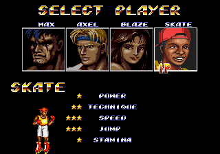

## Example #2A - Team Game
Streets of Rage 2 has four playable characters: Max, Axel, Blaze, and Skate. Each character has their own statistics and abilities that are significantly different enough to require a different strategy for each character.  You are given the chance to select a character once at the beginning of the game and you may change your selection after continuing.<br> 
<br>
<br>
 The following code will track if the player has used each character at least once.  The achievement will pause with the *unless* command whenever the screen mode is not in game.  That way we don’t trigger *hits* during the character selection screen. Using the *once* command the character selected comparison will latch on when said character is selected and it will stay on indefinitely. When using *hits* you would usually want include a *never* statement to reset the logic however, in this case we don’t need to reset the logic since the scope of the achievement is for the entire play session.  Note that the *hits* would all be reset in a new session.
```fsharp
// Streets of Rage 2
// #ID = 3

// $FC02: Screen Mode- 0=segalogo, 4=pressstart, 8=demo, c=mainmenu, 10=options, 14=ingame, 
//        18=charselect, 1c=ending, 24=introcards, 28=credits
function ScreenMode() => byte(0x00FC02)

// $FC50: Axel selected = 0xff
function AxelSelected() => word(0x00FC50) == 0xff

// $FC51: Max selected = 0xff
function MaxSelected() => word(0x00FC51) == 0xff

// $FC52: Skate selected = 0xff
function SkateSelected() => word(0x00FC52) == 0xff

// $FC53: Blaze selected = 0xff
function BlazeSelected() => word(0x00FC53) == 0xff

// Record a hit for each character active during gameplay
// This variation is the current core achievement
achievement(
    title = "Team Game", 
    description = "Play once as every character",
    points = 4,
    trigger = unless(ScreenMode() != 20) &&
        once(AxelSelected()) && 
        once(BlazeSelected()) &&
        once(MaxSelected()) && 
        once(SkateSelected())
)
```
The above works perfectly fine for tracking which character is used.  A measure could be added to this function to give the player some feedback of how many characters they have used. To add the measure we will need to combine the *hits* using the *tally* function.  Since the pause would disable the achievement while not in-game another modification was made to check the game mode with the selected character at the same time.  When two or more comparisons are combined together like this in an *once* command they are grouped together with *AndNext* flags.  So the result of this following code is a *AddHits* and *AndNext* chain that will sum up to four when every character has been selected.
```fsharp
// Record a hit for each character active during gameplay
// This variation of the using add hits to support using measure
achievement(
    title = "Example 2A: Team Game", 
    description = "Play once as every character", 
    points = 0,
    trigger = measured(
                  tally(4,
                      once(ScreenMode() == 20 && AxelSelected()),
                      once(ScreenMode() == 20 && MaxSelected()),
                      once(ScreenMode() == 20 && SkateSelected()),
                      once(ScreenMode() == 20 && BlazeSelected())
                  )
              )
)
```
This is a simple example of combining hits for multiple events. Next we will look at using hits to count enemy knockouts.<br>
<br>
Scripts: [Example #2A script](Example_02A_Streets_of_Rage_2.rascript) <br>
### Links
[Tutorial #2](readme.md) <br>
Example #2A<br>
[Example #2B](Example_2B.md) <br>
[Example #2C](Example_2C.md) <br>