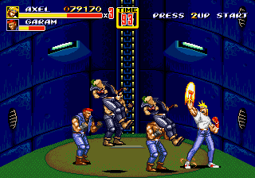
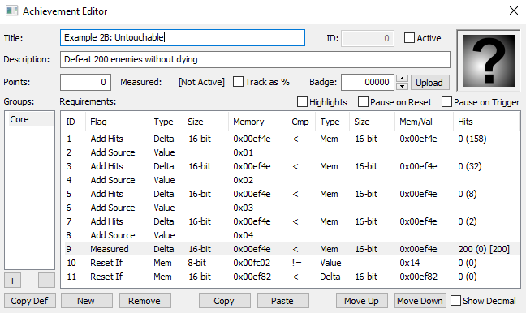

## Example #2B – Untouchable
The main goal of Streets of Rage 2 is to fight your way through eight different stages full of enemies trying to stop you from getting to their boss, Mr X. As such, you are constantly beating up and knocking out enemies as you play through the game.  The game memory tracks how many enemies you have knocked out overall from stage one.  You can use this information to add challenges like tracking how many enemies the player has knocked out in one life. <br>
<br>
 
Since the number of total knockouts from stage one might not be the same value as how many knockouts the player has done in one life we must track the value differently. The following code will increment one hit every time the Player1KO() value increases.  The knockout count will reset whenever the Player1Lives() value decreases.
```
// Streets of Rage 2
// #ID = 3

// $EF4E: Player one, number KOs
function Player1KO() => word(0x00EF4E)

// $EF82: Player one lives
function Player1Lives() => word(0x00EF82)

// $FC02: Screen Mode- 0=segalogo, 4=pressstart, 8=demo, c=mainmenu, 10=options, 14=ingame, 
//        18=charselect, 1c=ending, 24=introcards, 28=credits
function ScreenMode() => byte(0x00FC02)

// Count how many enemies where knocked out in one life
// This variation is the current core achievement
achievement(
    title = "Untouchable",
    description = "Defeat 200 enemies without dying", 
    points = 25,
    trigger = repeated(200, Player1KO() > prev(Player1KO())) &&
        never(Player1Lives() < prev(Player1Lives()))
)
```
Using *AddHits* to count like this has a potential issue that would throw the count off.  If the player knocks out two or more enemies at once the count would only increment by one. To remedy this you would need to add additional *hits* when the player knocks out two enemies, three enemies, four enemies, and five enemies.  Since Streets of Rage 2 has a maximum of five active enemies at once you would only need to track up to five simultaneous knock outs. The following code uses a combination of *AddHits* and *AddSource* to count how many knock outs have occurred:
``` // Count how many enemies where knocked out in one life
// This variation counts instance of multiple enemies getting knocked out at once.
achievement(
    
// Count how many enemies where knocked out in one life
// This variation counts instance of multiple enemies getting knocked out at once.
achievement(
    title = "Example 2B: Untouchable", 
    description = "Defeat 200 enemies without dying",
    points = 0,
    trigger = measured(
                  tally(200, 
                      prev(Player1KO()) < Player1KO(),
                      prev(Player1KO()) + 1 < Player1KO(),
                      prev(Player1KO()) + 2 < Player1KO(),
                      prev(Player1KO()) + 3 < Player1KO(),
                      prev(Player1KO()) + 4 < Player1KO()
                  )
              ) &&
              never(ScreenMode() != 20) &&
              never(Player1Lives() < prev(Player1Lives()))
) 
```
The above code might be easier to understand if we put some numbers to it. Let say that the previous number of knockouts prev(Player1KO()) is 100 and the player just knocked out three enemies at once raising the current number knockouts Player1KO() value to 103.  The following comparisons for that frame would evaluate to:
```
prev(Player1KO()) < Player1KO() ➡ 100 < 103 ➡ true add hit
prev(Player1KO()) + 1 < Player1KO() ➡ 101 < 103 ➡ true add hit
prev(Player1KO()) + 2 < Player1KO() ➡ 102 < 103 ➡ true add hit
prev(Player1KO()) + 3 < Player1KO() ➡ 103 < 103 ➡ false no hit
prev(Player1KO()) + 4 < Player1KO() ➡ 104 < 103 ➡ false no hit
```
The result of the above evaluation for that frame would add three *hits* to the total. This may seem like an edge case scenario however, multiple knockouts occur often since the enemies will clump in front of the player. <br>
### Test Run
Using the code Example 2B you can see the hit distribution that occurred during a test run. See the screenshot below for the results:<br>
<br>
 Remember that if multiple simultaneous knockouts occur one hit will be added to all of the previous comparisons.  Therefore to figure out the occurrence of each type of multi-knockout you must subtract the *hits* from the next comparison below. Out of 200 total knock outs there were:
* 0 Quintuple knock outs
* 2 Quadruple knock outs
* 6 Triple knock outs
* 24 Double knock outs
* 126 Single knock outs
### Results
If we were just using the condition ```prev(Player1KO()) < Player1KO()``` then **42 knock outs would have been missed!**  I wasn’t able to get a quintuple knock out during the test however, you can sleep well knowing that if a player does get five knock outs simultaneously all five will be counted.<br>
<br>
Scripts: [Example #2B script](Example_02B_Streets_of_Rage_2.rascript) <br>
<br>
### Links
[Tutorial #2](readme.md) <br>
[Example #2A](Example_2A.md) <br>
Example #2B <br>
[Example #2C](Example_2C.md)