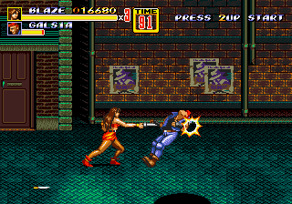

 ## Example 2C - Steel Grip
Besides beating up enemies with your bare knuckles the player can pick up and use weapons that the enemies drop.  Weapons significantly increase your damage so once you get a weapon, it is best to hold on to it for as long as possible.  The Steel Grip achievement rewards the player for holding on to the same weapon for ten or more knockouts.<br>
<br>
 
```
// Streets of Rage 2
// #ID = 3

// $EF33: 8-bit - Holding Weapon
function HoldingWeapon() => byte(0x00EF33)

// $EF37: 8-bit - Weapon Type
function WeaponType() => byte(0x00EF37)

// $EF4E: Player one, number KOs
function Player1KO() => word(0x00EF4E)

// $FC02: Screen Mode- 0=segalogo, 4=pressstart, 8=demo, c=mainmenu, 10=options, 14=ingame, 18=charselect, 1c=ending, 24=introcards, 28=credits
function ScreenMode() => byte(0x00FC02)

// Count how many enemies where knocked out while holding a weapon
// This variation is the current core achievement
achievement(
    title = "Steel Grip", 
    description = "Defeat 10 enemies without dropping your weapon", 
    points = 10,
    trigger = once(HoldingWeapon() == 1) &&
              repeated(10, Player1KO() > prev(Player1KO())) && 
              never(WeaponType() != prev(WeaponType())) &&
              never(HoldingWeapon() != 1)
)
```
## Homework 2
A) Adapt the Steel Grip achievement above to use *tally* similar to Example 2B so that multiple knock outs are counted.<br>
<br>
Scripts: [Example 2C script with no solution](Example_02C_Streets_of_Rage_2.rascript)<br>
<br>
Solutions: [Tutorial #2 Solution](./Solution/readme.md)<br>
<br>
Links:<br>
[Tutorial #2](readme.md)<br>
[Example 2A](Example_2A.md)<br>
[Example 2B](Example_2B.md)<br>
Example 2C