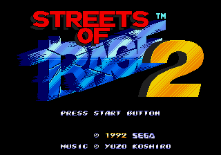

# Tutorial #2 - Add Hits
## Overview
This tutorial will show a few examples of how to use AddHits to create some achievements in RAScript.  [Streets of Rage 2](https://retroachievements.org/game/3) was chosen as the tutorial example to show how adding hits can be used to improve counting the number of enemies the player has knocked out. 
 
 
## AddHits
Each comparison in an achievement's logic is evaluated every frame. By default each comparison is set to zero *hits* which means that the comparison will not remember its previous evaluations. For the achievement to be triggered a comparison with zero *hits* must evaluate true in the same frame as the rest of the comparisons in the achievement’s logic. If the comparison is set to one or more *hits*, then the comparison will keep track of how many frames that the comparison evaluated to true. Once number of *hits* equals the initial *hits* setting the comparison will remain true until either the achievement is triggered or reset. 
 
In some cases you’ll want to combine *hits* together from multiple comparisons.  The following examples will show how to add *hits* together for tracking which characters the player has used and to count how many enemies the player has knocked out. This tutorial will use a few different type of RAScript *hits* related commands which can be found on the RATools wiki in the [Trigger-Functions](https://github.com/Jamiras/RATools/wiki/Trigger-Functions) section. 
 
Links: 
Tutorial #2 
[Example 2A](./Example_2A.md) 
[Example 2B](./Example_2B.md) 
[Example 2C](./Example_2C.md)