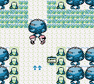

# Example 3A: Setting the Forest Ablaze
Pokémon Red|Blue is a Role Playing Game **(RPG)** where you collect and train Pokémon to fight other Pokémon Trainers around the Kanto region.  You also collect or buy special Items that can heal your Pokémon, remedy status affects, or help your Pokémon evolve. Both Trainer fights and Item pick ups are tracked in-game using **Bit Flags**. The following achievement is for when the player fights all of the Trainers and picks up all of the Items in the Viridian Forest.  The Viridian Forest area was selected since it was one of the smaller sections of the game however, you can use the same snippet of code for any section of the game by passing a different **Array** of **Bit Flags**.  It doesn’t matter if there are more or less **Bit Flags** than the example below since the code will adapt to the number of elements in the **Array** by using the `length()` function.<br>  

```
// Pokémon Red Version | Pokémon Blue Version
// #ID = 724

// An array on all the bitflags in the Viridian Forest
ViridianForest = [
    bit0(0xd6f0), // Hidden Potion
    bit1(0xd6f0), // Hidden Antidote
    bit4(0xd5b2), // Antidote
    bit5(0xd5b2), // Potion
    bit6(0xd5b2), // Poke Ball
    bit2(0xd7f3), // Bug Catcher 01
    bit3(0xd7f3), // Bug Catcher 02
    bit4(0xd7f3)  // Bug Catcher 03
]

// Check if array of passed flags goes from previously all but one flag is true
// to all flags being true.
function FlagsComplete(Flags)
{
    return sum_of(Flags, f => prev(f)) == length(Flags) - 1 &&
        measured(sum_of(Flags, f => f) == length(Flags)) 
}

// Make an achievement for finding every item and defeating every trainer 
// in the Viridian Forest
achievement(
    title = "Example 3A: Setting the Forest Ablaze", 
    description = "Find every Item and defeat every Trainer in the Viridian Forest.",
    points = 0,  
    trigger = FlagsComplete(ViridianForest) 
)
```
## sum_of
The above code utilizes the command **sum_of** to add the value of each **Bit Flag** in the **Array**.  Since a bit is 1 if on and 0 if off the summation of the **Bit Flags** will tell you how many **Bit Flags** are on.  Using the length of 8 for the **Array** in this example we test if the previous number of **Bit Flags** was 7 and the current number of bit flags that are on is 8.  The advantage of counting **Bit Flags** like this is that the player can collect the Items and fight the Trainers in any order and still get the achievement.  Additionally, we get save protection since the player must increment the **Bit Flag** count to get the achievement and it won’t trigger if they load a save file with the **Bit Flags** all on.
To help understand how to use **sum_of** it might help to deconstruct an example. Consider the line:
```
sum_of(Flags, f => prev(f))
```
The above line could be written as a **For Loop** where `Flags` is the **array** we are looping through and `f` is each element in the array. The following code is equivalent to the above:
```
sum = 0
for f in Flags
{
    sum = sum + prev(f)
}
// The value of sum if the number of bit flags that were on in the previous frame.
```
Note that the `f => prev(f)` part of the **sum_of** means that the previous value of each element is counted.  If we wrote `f => f` then the current value of each element is counted.
## Unrolling a Loop
To better understand how the **For Loop** is interpreted by the compiler you can unroll the loop into individual lines of code. Unrolling a loop is a technique used by programmers to optimize code since it avoids conditional jumps which take a small amount resources.  The technique is more useful on embedded hardware where resources are extremely limited however, it is a useful exercise when learning **For Loops**. Consider the same loop from above:
```
sum = 0
for f in Flags
{
    sum = sum + prev(f)
}
```
To unroll this For Loop we would copy the line of code inside of the eight times, one for each element in the **Array** and replace _f_ with the element.
```
sum = 0
sum = sum + prev(bit0(0xd6f0)) // Hidden Potion
sum = sum + prev(bit1(0xd6f0)) // Hidden Antidote
sum = sum + prev(bit4(0xd5b2)) // Antidote
sum = sum + prev(bit5(0xd5b2)) // Potion
sum = sum + prev(bit6(0xd5b2)) // Poke Ball
sum = sum + prev(bit2(0xd7f3)) // Bug Catcher 01
sum = sum + prev(bit3(0xd7f3)) // Bug Catcher 02
sum = sum + prev(bit4(0xd7f3)) // Bug Catcher 03
```
Both code snippets are equivalent however, the one using the **For Loop** is easier to write and there is less chance of a typo in the code.  **For Loops** become even more desirable when the number of elements in the **Array** increases.<br>
<br>
Scripts: [Example #3A script](Example_3A_Pokemon.rascript) <br>
### Links
[Tutorial #3](readme.md) <br>
Example #3A<br>
[Example #3B](Example_3B.md) <br>
[Example #3C](Example_3C.md) <br>