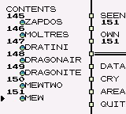

# Example 3B: Gotta ACTUALLY Catch 'em All
The main gimmick of Pokémon is that you can catch and train any of the 151 Pokémon in the game.  This is emphasized by the games’ catch phrase “Gotta Catch ‘em All”.  The game tracks both which Pokémon you have seen and/or caught in the Pokédex. When it was released Pokémon was sold as a Red and Blue version, each version with its own game exclusive Pokémon. So to actually catch all of the Pokémon you needed to trade Pokémon with someone else who had a different version of the game. Additionally some Pokémon like Mew require glitches to catch them.  Because of the requirement to trade with another person or use glitches the achievement this example is based on is from the bonus set. The reason why it was chosen as one of the examples is because catching all 151 Pokémon is tracked in consecutive bit flags which allows for some interesting optimizations.<br>  

```
// Pokémon Red Version | Pokémon Blue Version
// #ID = 724

// $C06E: Music Playng, title screen = 4105
function TitleMusic() => word(0x00C06E) == 4105

// Count each bit between $D2F7 bit 0 to $D309 bit 6 
// these are the consecutive bitflags for each of the  
// 151 Pokémon in the Pokédex
function PokedexCount()
{
   count = 0
    for address in range(0xD2F7, 0xD308) {
        count = count + bitcount(address)
    }
    count = count + sum_of(range(0,6), b => bit(b,0xD309))
    return count
}

// Create an achievement for when the player goes from
// 150 Pokémon to 151 Pokémon in the Pokédex
achievement(
    title = "Example 3B: Gotta ACTUALLY Catch 'em All", 
    description = "Catch all 151 Pokémon. Yes ALL of them.", 
    points = 0,
    trigger = never(TitleMusic()) &&
              prev(PokedexCount()) == 150 &&
              measured(PokedexCount() == 151)
)
```
## bitcount
The above example uses the fact that the Pokédex uses consecutive bits to optimize the code with **bitcount**.  Instead of adding the bits together with a **For Loop**, **bitcount** counts the bits with one command.  Consider line:
``` 
count = count + bitcount(address)
```
The bits could also be counted using the sum_of function like:
```
count = count + sum_of(range(0,7), b => bit(b, address))
```
Note that by using **bitcount** instead of **sum_of** we drastically reduce that number of lines generated by the script.  Instead of adding each bit per line we add eight bits per line. This results in 51 lines using **bitcount** instead of 303 lines using **sum_of**, approximately 6x smaller.
## sum_of bits
Another interesting trick in this example is the use of **sum_of** to add the last seven bits of the Pokedex.  Since we want to ignore the value of the eighth bit we can use **sum_of** to add the values of bits zero to six.  Note that the command `range(0,6)`  is a shortcut function which returns an **Array** of numbers, in this case `[0, 1, 2, 3, 4, 5, 6]` . Consider the line:
```
count = count + sum_of(range(0,6), b => bit(b,0xD309))
```
To help understand what going on we will unroll it like the previous example.
```
count = count + bit(0,0xD309) 
count = count + bit(1,0xD309)
count = count + bit(2,0xD309)
count = count + bit(3,0xD309)
count = count + bit(4,0xD309)
count = count + bit(5,0xD309) 
count = count + bit(6,0xD309)
```
By using **For Loops** we can make very complex achievements quickly and efficiently.<br>
<br>
Scripts: [Example #3B script](Example_3B_Pokemon.rascript) <br>
### Links
[Tutorial #3](readme.md) <br>
[Example #3A](Example_3A.md) <br>
Example #3B <br>
[Example #3C](Example_3C.md)