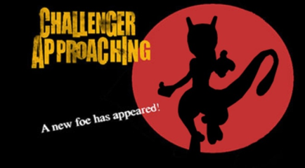

# Example 3C: Assemble the Dream Team
When battling other Trainers you can choose up to six Pokémon to fight for you. One of the most enjoyable aspects of Pokémon is the ability to mix and match your team.  By learning the strengths and weakness of each Pokémon type you can assemble your team to counter an opponent’s Team.  

## Homework #3
A)	Pick your six favorite Pokémon available in Pokémon Red | Blue.
B)	Using the Pokedex memory of **bitflags** between $D2F7 bit 0 to $D309 bit 6 create an achievement for catching all six Pokémon selected in part A. 
 
Solutions: [Tutorial #3 Solution](./Solution/readme.md) 
### Links
[Tutorial #3](readme.md) 
[Example #3A](Example_3A.md) 
[Example #3B](Example_3B.md) 
Example #3C