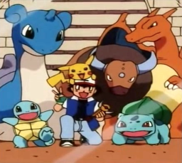

# Tutorial #3 Solution
## Solution A
For this example we selected the team Ash used when fighting the gym leader Drake to become the Orange League Champion in episodes 113 and 114 of the Anime. Ash selected: Pikachu, Squirtle, Tauros, Lapras, Bulbasaur, and Charizard.<br> 

## Solution B
Since the bits for the selected Pokémon are non-consecutive we can’t use the **bitcount** optimizations from [Example #3B](../Example_3B.md).  Instead we are counting the number of bit flags that are similar to [Example #3A](../Example_3A.md) since it can handle bits that are all over the place.
```
// Pokémon Red Version | Pokémon Blue Version
// #ID = 724

// $C06E: Music Playing, title screen = 4105
function TitleMusic() => word(0x00C06E) == 4105

DreamTeam = [
    bit0(0xd2f7), // Bulbasaur
    bit5(0xd2f7), // Charizard 
    bit6(0xd2f7), // Squirtle 
    bit0(0xd2fa), // Pikachu
    bit7(0xd306), // Tauros
    bit2(0xd307)  // Lapras
]

// Check if array of passed flags goes from previously all but one flag is true
// to all flags being true.
function FlagsComplete(Flags)
{
    return sum_of(Flags, f => prev(f)) == length(Flags) - 1 &&
        measured(sum_of(Flags, f => f) == length(Flags)) 
}

// Create an achievement for when the player collects the entire Dream Team
achievement(
    title = "Example 3C: Assemble the Dream Team", 
    description = "Catch Pikachu, Squirtle, Tauros, Lapras, Bulbasaur, and Charizard.", 
    points = 0,
    trigger = never(TitleMusic()) && FlagsComplete(DreamTeam)
)
```
[Example #3C with the above solution](Example_3C_Pokemon.rascript)<br>
### Links
[Tutorial #3](../readme.md)<br>
[Example #3A](../Example_3A.md)<br>
[Example #3B](../Example_3B.md)<br>
[Example #3C](../Example_3C.md)