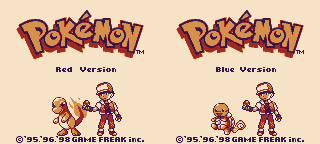

# Tutorial #3 – Bit Flags

## Overview 
This tutorial will show a few examples of how to create achievements for a game which has a lot of **Bit Flags**. [Pokémon Red|Blue](https://retroachievements.org/game/724) was chosen as the tutorial example because all the defeated Trainers, Item pickups, and caught Pokémon are tracked with bit flags.
  

## For Loops
The following examples use variations of **For Loops** to programmatically cycle through an **Array** of bit flags. **For Loops** are an extremely useful programming concept that allow you to execute a block of code any number of times. Using loops you can create very complex achievements in a few lines of code.  If you are unfamiliar with the concept of **For Loops** then please review the Khan Academy video [For Loops! A New Kind of Loop](https://www.khanacademy.org/computing/computer-programming/programming/looping/pt/for-loops-a-new-kind-of-loop)
 
## Arrays
**Arrays** are sequential data, of a single data type, that can be accessed with a numerical index. In RAScripts arrays can be numbers, text, conditions, or another nested **Array**.  **Arrays** work well together with **For Loops** since you can loop through an **Array** generating new code for each element in the **Array**. If you are unfamiliar with the concept of **Arrays** then please review the Khan Academy video [Intro to Arrays](https://www.khanacademy.org/computing/computer-programming/programming/arrays/pt/intro-to-arrays)
### Links
Tutorial #3 
[Example #3A](Example_3A.md) 
[Example #3B](Example_3B.md) 
[Example #3C](Example_3C.md)