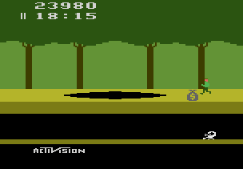

# Example 4A: Golden Log
**Pitfall!** Is a platforming game where you help Pitfall Harry traverse 255 horizontally connected screens of jungle avoiding obstacles and dangerous animals along the way.  The goal of **Pitfall!** is to recover the 32 hidden treasures before the 20:00 time limit expires. Each collected treasure increases the score between 2,000 and 5,000 points depending on the treasure type.  The player will lose points by touching a log or falling down into a pit.  This makes the players score an excellent measure of how a player is preforming.<br> 

```
// Pitfall!
// #ID = 11191

// $001E: 00=game active
function GameActive() => byte(0x00001E) == 0

// $0055: Score XX0000
// $0056: Score 00XX00
// $0057: Score 0000XX
function ScoreX00000() => high4(0x000055)
function Score0X0000() => low4(0x000055)
function Score00X000() => high4(0x000056)
function Score000X00() => low4(0x000056)
function Score0000X0() => high4(0x000057)
function Score00000X() => low4(0x000057)

// Converts the BCD score values into Base 10 decimal
function Score()
{
    return ScoreX00000() * 100000 +
        Score0X0000() * 10000 +
        Score00X000() * 1000 +
        Score000X00() * 100 +
        Score0000X0() * 10 +
        Score00000X()
}

// Check if the score goes from between low and high score to above the high score
function ScoreRange(lowScore, highScore)
{
    return prev(Score()) > lowScore &&
        prev(Score()) < highScore &&
        measured(Score() >= highScore)
}

// Create an achievement for scoring more than 25,000 points
achievement(
    title = "Example 4A: Golden Log", 
    description = "Score 25000 points", 
    points = 0,
    trigger =  GameActive() && 
        ScoreRange(15000, 25000)
) 
```
## Score()
The **Score()** function in this example handles the conversion from the displayed **BCD** value to a decimal value.  For clarity, each place value in memory is given a function with the naming convention showing an X over the place value for that memory.  The value in hundred thousands place is named ScoreX00000(), the value in the ten thousands place is Score0X0000(), and so on until we get to the ones place value named Score00000X().  To convert these BCD memory values to a decimal value we must multiply each by its place value and sum them together. The result is a number that we can use for achievement comparisons, rich presence text, or leaderboards.
## ScoreRange()
The **ScoreRange()** function uses the **Score()** function to convert the previous and current score values from BCD to decimal values.  The **ScoreRange()** function takes * lowScore* and * highScore* parameters then checks if the score goes from between *lowScore* and *highScore* to above the *highScore*.  **ScoreRange()** also incorporates a measure on the current score value so that the user gets feedback on how close they are to achieving the score. <br>
<br>
Since this function converts the **BCD** score to a decimal value we can enter any score value as parameters.  The *lowScore* 15,000 and *highScore* 25,000 were selected since the maximum frame score you can get in one frame is 5,000 points for collecting a diamond ring. By doubling the maximum frame score to 10,000 points we give ourselves a comfortable test range.  If the player is playing legitimately they will never increase more than 10,000 points in a frame so the achievement will trigger when they reach 25,000 points.  However, if the player is cheating, loads a save file, or the score memory is initially a large value when the emulator starts up then, the achievement will not trigger.  We don’t have to worry about save files for an Atari 2600 game however, the other two issues are a concern.<br>
<br>
Scripts: [Example #4A script](Example_4A_Pitfall!.rascript)<br>
### Links
[Tutorial #4](readme.md) <br>
Example #4A<br>
[Example #4B](Example_4B.md) <br>
[Example #4C](Example_4C.md) <br>