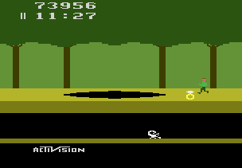

# Example 4B: Golden Scorpion
The challenge of **Pitfall!** comes from the strict time limit of needing to collect all 32 treasures in 20 minutes.  The time limit is so strict that you need to utilize some of the underground shortcuts to collect all the treasures in time.  Traversing an underground passage is equivalent to traversing three screens above ground so you can speed through very quickly underground. However, treasures only appear above ground and some underground passages are dead ends so you must map you route carefully to succeed. The following achievement rewards the player for scoring 70,000 points in under 15 minutes.  To accomplish this the player must utilize the underground passages.<br> 

```
// Pitfall!
// #ID = 11191

// $001E: 00=game active
function GameActive() => byte(0x00001E) == 0

// $0055: Score XX0000
// $0056: Score 00XX00
// $0057: Score 0000XX
function ScoreX00000() => high4(0x000055)
function Score0X0000() => low4(0x000055)
function Score00X000() => high4(0x000056)
function Score000X00() => low4(0x000056)
function Score0000X0() => high4(0x000057)
function Score00000X() => low4(0x000057)

// Converts the BCD score values into Base 10 decimal
function Score()
{
    return ScoreX00000() * 100000 +
        Score0X0000() * 10000 +
        Score00X000() * 1000 +
        Score000X00() * 100 +
        Score0000X0() * 10 +
        Score00000X()
}

// $0058: Time XX:00 (BCD)
//        20=out of game
// $0059: Time 00:XX (BCD)
// $005A: Time (miliseconds)
function TimeX00000() => high4(0x000058)
function Time0X0000() => low4(0x000058)
function Time00X000() => high4(0x000059)
function Time000X00() => low4(0x000059)
function Time0000XX() => byte(0x00005A)

// Converts the BCD time values into frames
// Note that minutes and seconds are BCD and the frames are already Base 10
function Time()
{
    return TimeX00000() * 36000 +
        Time0X0000() * 3600 +
        Time00X000() * 600 +
        Time000X00() * 60 +
        Time0000XX()
}

// Convert the time minutes:seconds:frames to frames (1/60s each)
function TimeSpan(minutes, seconds, frames) => minutes * 3600 + seconds * 60 + frames

// Check if the score goes from between low and high score to above the high score
function ScoreRange(lowScore, highScore)
{
    return prev(Score()) > lowScore &&
        prev(Score()) < highScore &&
        measured(Score() >= highScore)
}

// Create an achievement for scoring more than 75,000 points in 15 minutes or less
achievement(
    title = "Example 4B: Golden Scorpion", 
    description = "Score 70000 points in 15 minutes or less", 
    points = 0,
    trigger = GameActive() && 
        ScoreRange(60000, 70000) && 
        unless(Time() < Frames(5,0,0))
) 
```
## Time()
The **Time()** function in this example handles the conversion from the displayed **BCD** time value to a decimal value in frames.  It uses a very similar method to convert the **BDC** value as **Score()** however, the values used for each place differ since there are 60 frames in a second and 60 seconds in a minute.  To get the multiplication values that we multiply each place value by we need to calculate how many frames are in one place value.  The easiest way to do it is to start at the lowest place value, one frame, and then figure how many frames are in the next place value.
```
1 Frame = 1 Frame
1 Second = 60 Frames
10 Seconds = 600 Frames
1 minutes = 60 seconds = 3600 Frames
10 minutes = 600 seconds = 36000 Frames
```
## TimeSpan()
To complement the **Time()** function we use the **TimeSpan()** function to figure out how many frames are in a time span. The **TimeSpan()** function takes the parameters *minutes*, *seconds*, and *frames* then multiplies the *hours* by 3600 frames, *seconds* by 60 frames, and adds them to the *frames* which is already in frames.  The code uses this helper function to figure out how many frames there are left when the game clock is 5:00 (ie. 15 minutes after the start of the game).  You could use the value 18,000 frames directly however, writing a helper function like this is more convenient and makes the code easier to read.<br>
<br>
Scripts: [Example #4B script](Example_4B_Pitfall!.rascript) <br>
### Links
[Tutorial #4](readme.md) <br>
[Example #4A](Example_4A.md) <br>
Example #4B <br>
[Example #4C](Example_4C.md)