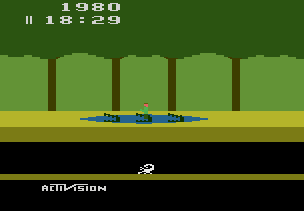

# Example 4C: Golden Survivor
There are many dangers in the jungle and Pitfall Harry must proceed carefully to stay safe. Harry only has two extra lives before the game is over!  Since there is no opportunity to regain lives each life is very valuable. 

## Homework #4
A) Using the functions in the previous example make an achievement for scoring 50,000 points without dying.  Additionally, use memory address $000000 which encodes the 1st life as bit 5 and the 2nd life as bit 7.
 
Solutions: [Tutorial #X Solution](./Solution/readme.md) 
### Links
[Tutorial #4](readme.md) 
[Example #4A](Example_4A.md) 
[Example #4B](Example_4B.md) 
Example #4C