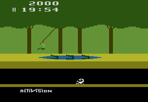

# Solution #4
By adding the two life bitflags together we get a decimal value for how many **Lives()** the player has.  The example below could have been done by only checking if bit 7 was on however, the **Lives()** function return a value that we can use in other parts of the code like rich presences or leaderboards.<br>

```fsharp
// Pitfall!
// #ID = 11191

// $0000: Lives
//        bit5=1st extra life
//        bit7=2nd extra life
function Life1() => bit5(0x000000)
function Life2() => bit7(0x000000)

// Converts the two life bits to a decimal value
function Lives() => Life1() + Life2()

// $001E: 00=game active
function GameActive() => byte(0x00001E) == 0

// $0055: Score XX0000
// $0056: Score 00XX00
// $0057: Score 0000XX
function ScoreX00000() => high4(0x000055)
function Score0X0000() => low4(0x000055)
function Score00X000() => high4(0x000056)
function Score000X00() => low4(0x000056)
function Score0000X0() => high4(0x000057)
function Score00000X() => low4(0x000057)

// Converts the BCD score values into Base 10 decimal
function Score()
{
    return ScoreX00000() * 100000 +
        Score0X0000() * 10000 +
        Score00X000() * 1000 +
        Score000X00() * 100 +
        Score0000X0() * 10 +
        Score00000X()
}

// Check if the score goes from between low and high score to above the high score
function ScoreRange(lowScore, highScore)
{
    return prev(Score()) > lowScore &&
        prev(Score()) < highScore &&
        measured(Score() >= highScore)
}

// Create an achievement for scoring more than 50,000 without losing a life
achievement(
    title = "Example 4C: Golden Survivor", 
    description = "Score 50000 without losing a life", 
    points = 0,
    trigger = GameActive() && 
        ScoreRange(40000, 50000) && 
        unless(Lives() != 2)
) 
```
By converting the memory values to **Base 10** decimals we allow for many different types of possible achievements.<br>
<br>
Scripts: [Example #4C](Example_4C_Pitfall!.rascript)<br>
### Links
[Tutorial #4](../readme.md)<br>
[Example #4A](../Example_4A.md)<br>
[Example #4B](../Example_4B.md)<br>
[Example #4C](../Example_4C.md)