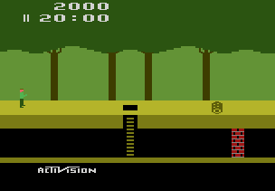

# Tutorial #4 – Arithmetic Operations
## Overview
This tutorial will show a few examples of how to create achievements for a game that requires **Arithmetic Operations** to convert memory values to **Base 10** decimal values. [Pitfall!](https://retroachievements.org/game/11191) was chosen for this example because it has different encoding techniques for the time, score, and lives.
 

## Decimal (Base 10)
There are many ways to describe a number value and we commonly use the decimal system in everyday language.  The decimal system is **Base 10** which describes how many possible values there are in each place value.  In a **Base 10** system the ones place value can be the numbers 0 to 9, after 9 you add one to the next place value to get the number 10.  Similarly, the tens place value can be the numbers 0 to 9, after 9 you add one to the hundreds place value to get the number 100.
## Binary (Base 2)
Computers think in **binary** which is a **Base 2** number system.  **Base 2** is a simplified numbering system where each place value is either b1 which means an electrical current was present or b0 which means no current was present (note that the *b* before the number indicates a binary number).  In a **Base 2** system the first place value can be the numbers b0 or b1, to represent the number 2 we need the second place value b10. Similarly, the second place value can either be a b1 or a b0, to represent the number 4 we need a third place value b100.
## Hexadecimal (Base 16)
Another common encoding for computers is **hexadecimal** which is a **Base 16** system. The reason why **hexadecimal** is a popular counting system on computers is that it translates very easily to the **binary** system.  In a **Base 16** system there 16 possible numbers per place value which can be represented b0000 to b1111 in binary. In **hexadecimal** the number 10, 11, 12, 13, 14, and 15 are written as 0xA, 0xB, 0xC, 0xD, 0xE, and 0xF respectively (note that the *0x* before the number indicates a **hexadecimal** number).  To represent a number greater than 15 you need two **hexadecimal** place values, for example the number 16 is 0x10. Similarly, the second place value can be the numbers 0x0 to 0xF, after 0xF you add one to the third place value to get the number 0x100 (or 256 in decimal).
## Binary-Coded Decimal (BCD)
A very common method of encoding values that are displayed on the screen is to use **Binary-Coded Decimal (BCD)**.  BCD is a combination of **Base 10** and **Base 16** systems.  **BCD** uses **Base 10** counting in the respect that each place value can be between 0 to 9.  However, this value is store as a **Base 16** value in memory which means the values above 9 are ignored.  The reason for encoding values in **BCD** is that is simplifies displaying the value on the screen.  When drawing a score on the screen the program will look every 4 bits in the score which will be a value between 0 and 9, then the program would draw the sprite for that number and move on to the next 4 bits.  Storing values as **BCD** makes it much easier to display on a screen then storing a value in **Base 10** which would require a conversion before displaying.
### Links
Tutorial #4 
[Example #4A](Example_4A.md) 
[Example #4B](Example_4B.md) 
[Example #4C](Example_4.md)