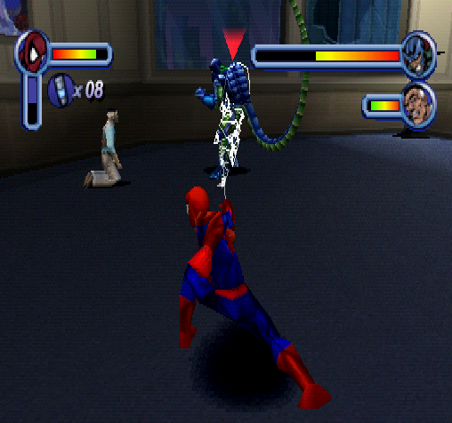

# Example 5A: Get Over Here!
Spider-Man has an impressive rogues gallery of animal based villains that he must stop to protect the citizens of New York.  In this achievement Scorpion is trying to settle a score with J. Jonah Jameson and Spider-Man is the only one who can save him.  As a challenge the web-slinger must defeat Scorpion without taking damage, letting Jameson take damage, or letting Scorpion find Jameson’s hiding place.<br>
 

```
// Spider-Man
// #ID = 11319

// $0A568D: Chapter ID (US)
function ChapterID() => byte(0x0A568D)

// $0A568F: Level ID? (US)
function LevelID() => byte(0x0A568F)

// $0A5704: Costume Selected (US)
//          00 - Default
//          01 - Spider-Man 2099
//          02 - Symbiote Spider-Man
//          03 - Captain Universe
//          04 - Spider-Man Unlimited
//          05 - Amazing Bag-Man
//          06 - Scarlet Spider-Man
//          07 - Ben Reilly
//          08 - Quick-Change Spider-Man
//          09 - Peter Parker
function CostumeSelected() => byte(0x0A5704)

// $0B4F34: Various Flags (US)
//          01 - Menu
//          02 - Game Over
//          03 - Level Completed Flag
//          07 - Quit to Main Menu
//          08 - Level Restart
//          0A - Quit to Training
function Flags() => byte(0x0B4F34)

// $0B4F38: Level Time? (32-Bit) (US)
//          (Continues counting while paused)
function LevelTime() => dword(0x0B4F38)

// $0B4F40: Difficulty? (US)
//          00 - Kid Mode
//          01 - Easy
//          02 - Normal
//          03 - Hard
function Difficulty() => byte(0x0B4F40)

// $0B4F6C: Invincibility Cheat Boolean (00/01) (US)
function InvincibilityCheat() => byte(0x0B4F6C)

// $0B4F98: Unlimited Webbing Cheat Boolean (00/01) (US)
function UnlimitedWebbingCheat() => byte(0x0B4F98)

// $0B5268: Player Stats Pointer? (US)
//          +04 - X Coordinates
//          +08 - Y Coordinates
//          +0C - Z Coordinates
//          +DE - Health
//          +140 - Animation ID
//          +150 - Another Animation ID?
//          +1A8 - Cutscene Playing (01)
//          +5D8 - Webbing
//          +5DC - Web Cartridges
//          +5F0 - Spidey Armor Active
//          +5F8 - Spidey Armor Strength
//          +5EC - Magnesium Webbing (01)
//          +EE8 - Pointer to Current Enemy
//          +EEB - Target Type
//          +1014 - Max Health
function PlayerStatsPointer() => tbyte(0x0B5268)
function PlayerStatsNotNull() => dword(0x0B5268) != 0
function PlayerHealth() => byte(PlayerStatsPointer() + 0x0000DE)

// $0B5640: Jameson Health/Stats Pointer
//          +DE - Health
//          +140 - Animation ID
function JamesonPointer() => tbyte(0x0B5640)
function JamesonNotNull() => dword(0x0B5640) != 0
function JamesonHealth() => byte(JamesonPointer() + 0x0000DE)
function JamesonAnimation() => byte(JamesonPointer() + 0x000140)

// $0B58D8: Cutscene Letterbox Size (1E) (US)
function CutscreenSize() => byte(0x0B58D8)

// No cheating conditions common for the entire set.
function NoCheats()
{
    // Pause if any the costume with special abilities are selected
    // ie. Spider-Man 2099, Symbiote Spider-Man, Captain Universe, Spider-Man Unlimited
    noSpecialCostumes = unless((CostumeSelected() >= 1 && CostumeSelected() <= 4))

    // Pause if the player is in kid mode (difficulty 0)
    noKidsMode = unless(Difficulty() == 0)

    // Pause if the player is cheating
    noCheats = unless(InvincibilityCheat() != 0) && 
        unless(UnlimitedWebbingCheat() != 0)

    return noSpecialCostumes && noKidsMode && noCheats
}

//---------------------------------------------------------------------
// Function to build the "Example 5A: Get Over Here!" achievement
function ScorpionBossFight(title, description, points)
{
    // Trigger achievement when we are on the level Spidey Vs. Scorpion! and
    // the level complete flag turns on
    progress = trigger_when((
        prev(ChapterID()) == 50 && 
        prev(LevelID()) == 50 &&
        Flags() != prev(Flags()) &&
        Flags() == 3))

    // Add a measure for how long until Jameson is found
    start = measured(once(prev(LevelTime()) < 32))

    // Reset if the players health decreases
    spidyDamageless = never(
        PlayerStatsNotNull() &&
        PlayerHealth() < prev(PlayerHealth()))

    // Reset if Jameson's health decreases
    jamesonDamageless = never(
        JamesonNotNull() &&
        JamesonHealth() < prev(JamesonHealth()))

    // Reset if Jameson's is found (Jameson animation changes)
        jamesonNotFound = never(
        CutscreenSize() == 0 && 
        JamesonNotNull() && 
        JamesonAnimation() != prev(JamesonAnimation()) && 
        JamesonAnimation() == 59)
        
    // Reset if the level changes
    noLevelChange = never(prev(ChapterID()) != 50) && 
        never(prev(LevelID()) != 50)
        
    achievement(title, description, points, progress && start && spidyDamageless && 
        jamesonDamageless && jamesonNotFound && noLevelChange && NoCheats())
}
ScorpionBossFight("Example 5A: Get Over Here!", 
    "Defeat Scorpion without Spidey or Jameson taking damage and without letting Scorpion find Jameson", 25)
```
## Pointer Functions
```
function PlayerStatsPointer() => tbyte(0x0B5268)
function PlayerHealth() => byte(PlayerStatsPointer() + 0x0000DE)
```
To make it easier to reference *pointers* you can write helper functions that handle the details.  The function ```PlayerStatsPointer()``` references the *pointer* address as a ```tbyte``` to use the bottom 24-bits of the address.  The function ```PlayerHealth()``` adds the offset ```0xDE``` to the *pointers’* address so it dynamically changes it’s address whenever the *pointer* changes.  Helper functions like these can be made for each *data offset* you want to reference.
## Null Pointers
```
function PlayerStatsNotNull() => dword(0x0B5640) != 0
```
A *pointer* will be null (zero) before memory is allocated to it or after the memory has been released back to the operating system.  Its standard programming practice to check if a *pointer* is null before trying to access the memory it is pointing to.  It is also good practice to do the same when writing achievements otherwise you could be referencing the wrong memory.  For example, if the ```PlayerStatsPointer()``` was null the ```PlayerHealth()``` would be pointed to ```byte(0xDE)```.  To avoid this the function ```PlayerStatsNotNull()``` is used with the condition ``` PlayerStatsNotNull() && PlayerHealth() < prev(PlayerHealth()))``` to reset if a player has lost health.  Using a null check before referencing a pointer will save you many future headaches.<br>
<br>
Scripts: [Example #5A script](Example_5A_Spider-Man.rascript) <br>
### Links
[Tutorial #5](readme.md) <br>
Example #5A<br>
[Example #5B](Example_5B.md) <br>
[Example #5C](Example_5C.md) <br>