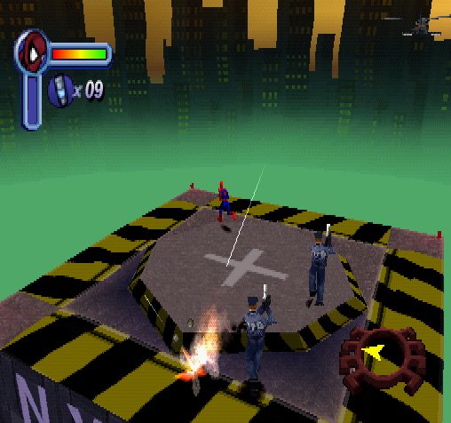

# Example 5B: I'm Not the Bad Guy!
Despite his heroism, Spider-Man is a vigilante so he often finds himself in trouble with the law.  To make matters worse, someone impersonated Spider-Man during a recent heist making him public enemy #1. In this achievement the police are chasing Spider-Man over a series of five different levels.  Despite being hunted Spider-Man is a moral superhero who believes that “with great power comes great responsibility” so he must evade the police without harming them.<br>
 

```fsharp
// Spider-Man
// #ID = 11319

// $0A568D: Chapter ID (US)
function ChapterID() => byte(0x0A568D)

// $0A568F: Level ID? (US)
function LevelID() => byte(0x0A568F)

// $0A56E4: Level Completed Count: Police Chopper Chase (US)
function PoliceChopperChaseComplete() => byte(0x0A56E4)

// $0A56E5: Level Completed Count: Missile Attack (US)
function MissileAttackComplete() => byte(0x0A56E5)

// $0A56E6: Level Completed Count: Building Top Chase (US)
function BuildingTopChaseComplete() => byte(0x0A56E6)

// $0A56E7: Level Completed Count: Scale the Girders (US)
function ScaleTheGirdersComplete() => byte(0x0A56E7)

// $0A56E8: Level Completed Count: Police Evaded (US)
function PoliceEvadedComplete() => byte(0x0A56E8)

// $0A5704: Costume Selected (US)
//          00 - Default
//          01 - Spider-Man 2099
//          02 - Symbiote Spider-Man
//          03 - Captain Universe
//          04 - Spider-Man Unlimited
//          05 - Amazing Bag-Man
//          06 - Scarlet Spider-Man
//          07 - Ben Reilly
//          08 - Quick-Change Spider-Man
//          09 - Peter Parker
function CostumeSelected() => byte(0x0A5704)

// $0B4F34: Various Flags (US)
//          01 - Menu
//          02 - Game Over
//          03 - Level Completed Flag
//          07 - Quit to Main Menu
//          08 - Level Restart
//          0A - Quit to Training
function Flags() => byte(0x0B4F34)

// $0B4F38: Level Time? (32-Bit) (US)
//          (Continues counting while paused)
function LevelTime() => dword(0x0B4F38)

// $0B4F40: Difficulty? (US)
//          00 - Kid Mode
//          01 - Easy
//          02 - Normal
//          03 - Hard
function Difficulty() => byte(0x0B4F40)

// $0B4F6C: Invincibility Cheat Boolean (00/01) (US)
function InvincibilityCheat() => byte(0x0B4F6C)

// $0B4F98: Unlimited Webbing Cheat Boolean (00/01) (US)
function UnlimitedWebbingCheat() => byte(0x0B4F98)

// $0B5268: Player Stats Pointer? (US)
//          +04 - X Coordinates
//          +08 - Y Coordinates
//          +0C - Z Coordinates
//          +DE - Health
//          +140 - Animation ID
//          +150 - Another Animation ID?
//          +1A8 - Cutscene Playing (01)
//          +5D8 - Webbing
//          +5DC - Web Cartridges
//          +5F0 - Spidey Armor Active
//          +5F8 - Spidey Armor Strength
//          +5EC - Magnesium Webbing (01)
//          +EE8 - Pointer to Current Enemy
//          +EEB - Target Type
//          +1014 - Max Health
function PlayerStatsPointer() => tbyte(0x0B5268)
function PlayerStatsNotNull() => dword(0x0B5268) != 0
function PlayerCutscene() => byte(PlayerStatsPointer() + 0x0001A8)
function PlayerTargetType() => dword(PlayerStatsPointer() + 0x000EEB)
function PlayerTargetPointer() => tbyte(PlayerStatsPointer() + 0x000EE8)
function PlayerTargetHealth() => byte(PlayerTargetPointer() + 0x0000DE)

// No cheating conditions common for the entire set.
function NoCheats()
{
    // Pause if any the costume with special abilities are selected
    // ie. Spider-Man 2099, Symbiote Spider-Man, Captain Universe, Spider-Man Unlimited
    noSpecialCostumes = unless((CostumeSelected() >= 1 && CostumeSelected() <= 4))

    // Pause if the player is in kid mode (difficulty 0)
    noKidsMode = unless(Difficulty() == 0)

    // Pause if the player is cheating
    noCheats = unless(InvincibilityCheat() != 0) && 
        unless(UnlimitedWebbingCheat() != 0)

    return noSpecialCostumes && noKidsMode && noCheats
}

// ------------------------------------------------------------------------
// Function to build the "Example 5B: I'm Not the Bad Guy!" achievement
function PoliceChase(title, description, points)
{
    // Count the completion of each of the 5 police missions
    progress = trigger_when(
        tally(5,
            once(PoliceChopperChaseComplete() > prev(PoliceChopperChaseComplete())), 
            once(MissileAttackComplete() > prev(MissileAttackComplete())), 
            once(BuildingTopChaseComplete() > prev(BuildingTopChaseComplete())), 
            once(ScaleTheGirdersComplete() > prev(ScaleTheGirdersComplete())), 
            once(
                prior(ChapterID()) == 51 && 
                prior(LevelID()) == 53 && 
                PoliceEvadedComplete() > prev(PoliceEvadedComplete()) && 
                Flags() == 3
            ), 
            always_false()
        )
    )
        
    // Add a hit at the beginning of the level
    start = measured(
        once(
            ChapterID() == 51 && 
            LevelID() == 49 && 
            prev(LevelTime()) < 32
        )
    )

    // Reset if a police officer is harmed
    // This is a pointer of a pointer, the player stats pointer has a target pointer in it.
    // When the target pointer is pointing to a police officer check if their health decreases.
    officerSafe = never(
        (PlayerStatsNotNull() && 
        (PlayerCutscene() == 0) &&
        (PlayerTargetType() == 128) &&
        (PlayerTargetPointer() == prev(PlayerTargetPointer())) &&
        PlayerTargetHealth() < prev(PlayerTargetHealth()))
    )

    achievement(title, description, points, progress && start && officerSafe && NoCheats())
}
PoliceChase("Example 5B: I'm Not the Bad Guy!", 
    "Complete all five levels of the police chase without attacking any cops", 10)
```
## Double Pointers
```
function PlayerStatsPointer() => tbyte(0x0B5268)
function PlayerTargetPointer() => tbyte(PlayerStatsPointer() + 0x000EE8)
function PlayerTargetHealth() => byte(PlayerTargetPointer() + 0x0000DE)
```
A major complexity with *pointers* is that they can point to another *pointer* otherwise known as a double *pointer*.  You can have a chain of *pointers* that continually point to the next or previous piece of memory also known as a linked list.  Hopefully you only have to deal with single *pointers* however, if you do have double or more *pointers* you can use the same process described here for each *pointer* reference.  In the above example the player’s stats *pointer* has a target *pointer* in it which points to the enemy Spider-Man is looking at. The game uses a red arrow over Spider-Man’s current target to show who Spider-Man would attack if commanded to. To reference the health of a police officer you’ll need to follow the *pointer* from the players’ stats *pointer* to the player target *pointer*.  Fortunately it appears that Spider-Man and the police officers share the same data structure so the police officers health is ```+0xde``` from the address in the player’s target *pointer*.  The above functions simplify following the *pointer* addresses’ so you can use ```PlayerTargetHealth()``` as you would for regular memory.<br>
<br>
Scripts: [Example #5B script](Example_5B_Spider-Man.rascript) <br>
### Links
[Tutorial #5](readme.md) <br>
[Example #5A](Example_5A.md) <br>
Example #5B <br>
[Example #5C](Example_5C.md)