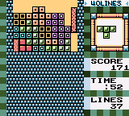

# Example 6A: 40 Lines Mode
Tetris is a puzzle game where the main goal is to rotate and align the falling Tetriminos to create a solid horizontal line. When a solid horizontal line is made the game will remove the line from the board and award points depending on how many lines were cleared at once. The 40 Lines Mode in [Tetris DX](https://retroachievements.org/game/4939) is a special mode where you must complete 40 lines at various starting heights and speeds. The higher the starting height and/or speed the more difficult the challenge is.<br>
<br>
```
// Tetris DX
// #ID = 4939

// $AC0A: 0=marathon  1=ultra
//        2=40lines   3=vs.com
function GameType() => byte(0x00AC0A)

// $AC24: Number of lines completed
function Lines() => byte(0x00AC24)

// $DB10: speed level in 40 lines
function Speed() => byte(0x00DB10)

// $DB11: high-level
function HighLevel() => byte(0x00DB11)

// Create a forty lines mode achievements with starting high-level, speed conditions, or both
function FortyLines(title, description, points, highLevel, speed)
{
    // Always check for game mode 40 lines and
    // if previous lines was between 36 to 39 and the current lines is 40 or more
    trigger = GameType() == 2 && 
        prev(Lines()) >= 36 && 
        prev(Lines()) <= 39 &&
        Lines() >= 40
    
    // If the high level setting is greater than zero then add the high level condition
    if (highLevel > 0) 
        trigger = trigger && HighLevel() == highLevel        
       
    // If the speed setting is greater than zero then add the speed condition
    if (speed > 0) 
        trigger = trigger && Speed() == speed
        
    achievement(title, description, points, trigger)
}

// Create seven forty lines mode achievements using variations of the same function
FortyLines("Example 6A: One-High", "Beat [40 Lines] mode on 1-High.", 2, 1, 0)
FortyLines("Example 6A: Two-High", "Beat [40 Lines] mode on 2-High.", 3, 2, 0)
FortyLines("Example 6A: Three-High", "Beat [40 Lines] mode on 3-High.", 5, 3, 0)
FortyLines("Example 6A: Four-High", "Beat [40 Lines] mode on 4-High.", 5, 4, 0)
FortyLines("Example 6A: Five-High", "Beat [40 Lines] mode on 5-High.", 10, 5, 0)
FortyLines("Example 6A: Mach 40", "Beat [40 Lines] mode on Speed Level 9.", 5, 0, 9)
FortyLines("Example 6A: Light Speed", "Beat [40 Lines] mode on 5-High and Speed Level 9.", 10, 5, 9)
```
## Dealing with Variations
The above example takes advantage of the fact that only one or two conditions change for each of the 40 Line Mode achievements. Using **logical constructs**, the resulting achievement is built differently depending on the passed parameters.  If the *highLevel* parameter is greater than zero then an additional condition is added to the achievement to check if the current high level value is the passed *highLevel* value. Similarly, if the *speed* parameter is greater than zero then an additional condition is added to the achievement to check if the current speed value is the passed *speed value*.  By adding a few **logical constructs** to the function *FortyLines()* we expanded its capabilities to handle multiple starting heights and/or speeds.<br>
<br>
Scripts: [Example #6A script](Example_6A_Tetris_DX.rascript) <br>
### Links
[Tutorial #6](readme.md) <br>
Example #6A<br>
[Example #6B](Example_6B.md) <br>
[Example #6C](Example_6C.md) <br>