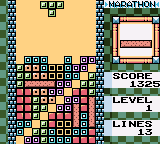

# Example 6B: Not Quite a Grandmaster
The Tetris board is limited to 10 blocks across and 20 blocks high (10x19 on the game boy due to the reduced screen size).  Once blocks stack over the height limit the game is over.  To become a Tetris Grandmaster you must be able to control where the gaps in a line are no matter what pieces you are given.  One way to practice controlling the board is to perform the Grandmaster build which starts with a gap on the far bottom left of the board and then has a gap one cell to the right and up until the gap is on the other side of the board. Master this build and you are one step closer to becoming a Tetris Grandmaster!<br>
<br>
 
```fsharp
// Tetris DX
// #ID = 4939

// $AD02: Tetris Board 10x19
//        Cell(0,0) = $AD02, Cell(9,0) = $AD0B, 
//        Cell(0,1) = $AD12, Cell(9,1) = $AD1B,
//        ... 
//        Cell(0,18) = $AE22, Cell(9,18) = $AE2B
function Cell(x,y) => byte(0xAD02 + x + (y * 16))

// Shortcut cell definitions
MT = 0xfb // Empty square
HL = 0xb0 // I horizontal left piece (orange)
HC = 0xb1 // I horizontal center piece
HR = 0xb2 // I horizontal right piece
VT = 0xb3 // I vertical top piece
VM = 0xb4 // I vertical center piece
VB = 0xb5 // I vertical bottom piece
LP = 0x88 // L piece (red)
JP = 0x90 // J piece (light blue)
TP = 0x98 // T piece (light green)
ZP = 0xa0 // Z piece (yellow)
SP = 0xa8 // S piece (purple)
OP = 0x80 // O piece (black)

// Special cells
NE = 0xff // Any square (not empty)
NO = 0x0  // Nothing (ignore)

// Build a set of conditions to test for the passed map
function TetrisMap(map)
{
    mapArray = []
    for y in range(0,18)
    {
        for x in range(0,9)
        {
            // Get the value of current cell
            cell = map[y][x]            
            if (cell == NE)
                // If any cell then test not empty
                array_push(mapArray, Cell(x,y) != MT)
            else if (cell != NO) 
                // If not ignoring cell then test for current cell value
                array_push(mapArray, Cell(x,y) == cell)
        }
    }
    return all_of(mapArray, a => a)
}

grandmaster= [
    [NO,NO,NO,NO,NO,NO,NO,NO,NO,NO],
    [NO,NO,NO,NO,NO,NO,NO,NO,NO,NO],
    [NO,NO,NO,NO,NO,NO,NO,NO,NO,NO],
    [NO,NO,NO,NO,NO,NO,NO,NO,NO,NO],
    [NO,NO,NO,NO,NO,NO,NO,NO,NO,NO],
    [NO,NO,NO,NO,NO,NO,NO,NO,NO,NO],
    [NO,NO,NO,NO,NO,NO,NO,NO,NO,NO],
    [NO,NO,NO,NO,NO,NO,NO,NO,NO,NO],
    [NO,NO,NO,NO,NO,NO,NO,NO,NO,NO],
    [NE,NE,NE,NE,NE,NE,NE,NE,NE,MT],
    [NE,NE,NE,NE,NE,NE,NE,NE,MT,NE],
    [NE,NE,NE,NE,NE,NE,NE,MT,NE,NE],
    [NE,NE,NE,NE,NE,NE,MT,NE,NE,NE],
    [NE,NE,NE,NE,NE,MT,NE,NE,NE,NE],
    [NE,NE,NE,NE,MT,NE,NE,NE,NE,NE],
    [NE,NE,NE,MT,NE,NE,NE,NE,NE,NE],
    [NE,NE,MT,NE,NE,NE,NE,NE,NE,NE],
    [NE,MT,NE,NE,NE,NE,NE,NE,NE,NE],
    [MT,NE,NE,NE,NE,NE,NE,NE,NE,NE]
]

achievement(
    title = "Example 6B: Not Quite a Grandmaster",
    description = "Perform the secret grade grandmaster build up to the opposite wall", 
    points = 25,
    trigger = TetrisMap(grandmaster)
)
```
## Two-Dimensional Arrays
To test for the Grandmaster build a two-dimensional array (an array of arrays) is defined with the desired value for each cell.   Puzzle and single screen games typically have a map of cells that represent the board game.  In Tetris’s case the map of cells define several block types that could be in each cell. If the array is:
* ```NE``` then the cell must have a block in it but it can be any type of block
* ```MT``` then cell must be empty
* ```NO``` then cell is ignored so it can be any block or empty
* Otherwise the cell value must match what is in the array
## Data and Memory Alignment
To align the two-dimensional array with the in-game memory the function ```Cell(x,y)``` takes in a x,y coordinate and returns the byte of memory for that cell.  When reading the desired value from the two-dimensional you can access the array by index ```map[y][x]```.  Note that the x and y are reversed for the array access.  This is because the array is define as an array of rows where ```row = map[y]``` gets you the array at row y. To get the cell value from the row you would need to index ```cell = row[x]``` which is the equivalent of ```map[y][x]```.  This is just one method for building this achievement, as the designer you can define the array configuration differently or use an entirely different method.
## all_of
Because the ```TetrisMap()``` function is data driven we don’t know exactly how many conditions are needed until the function is called.  The conditions are then built up for any cell that is not ignored (any cell not equal to ```NO```).  An empty array ```mapArray[]``` is defined at the top of the function and all the not ignored cell conditions are pushed on to the array.  At the end of the function the ```all_of``` command takes the array of conditions and returns a single condition with everything &&’d together.  The conditions could have been built using a similar method as [Example 6A](Example_6A.md) with ```trigger = trigger && condition``` however, the ```all_of``` is more concise.<br>
<br>
Scripts: [Example #6B script](Example_6B_Tetris_DX.rascript) <br>
### Links
[Tutorial #6](readme.md) <br>
[Example #6A](Example_6A.md) <br>
Example #6B <br>
[Example #6C](Example_6C.md)
