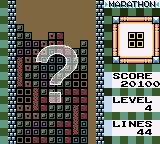

# Example #6C - 
# Example 6C: Pattern Design
The ultimate goal of Tetris is survival since the blocks will fall faster as the game goes on giving you less time to react.  Being able to quickly recognize patterns can improve your ability to play at the high levels.  As such being able to create pre-defined patterns is the hallmark of a great Tetris player! 
 
 
## Homework #6
A) Design a 10x19 Tetris pattern 
B) Use the code from [Example 6B](Example_6B.md) as a guide and replace the Tetris array map with the pattern defined in part A. 
 
Solutions: [Tutorial #6 Solution](./Solution/readme.md) 
### Links
[Tutorial #6](readme.md) 
[Example #6A](Example_6A.md) 
[Example #6B](Example_6B.md) 
Example #6C