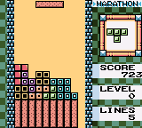

# Tutorial #6 Solution
A) For this example we chose the “Tetris Deluxe” pattern which requires you to fill the bottom 4 rows with vertically stacked ‘I’ beams.  The ‘I’ beam is the most important Tetrimino type in the game since it is the only Tetrimino that can make a **Tetris** (clearing four lines at once). Note that the top, middle, and bottom cells of the ‘I’ beam are all different.  All of the other Tetrimino types share the same cell for every part of the block.<br> 
<br>
B) Source code for “Tetris Deluxe” pattern.<br>
```
// Tetris DX
// #ID = 4939

// $AD02: Tetris Board 10x19
//        Cell(0,0) = $AD02, Cell(9,0) = $AD0B, 
//        Cell(0,1) = $AD12, Cell(9,1) = $AD1B,
//        ... 
//        Cell(0,18) = $AE22, Cell(9,18) = $AE2B
function Cell(x,y) => byte(0xAD02 + x + (y * 16))

// Shortcut cell definitions
MT = 0xfb // Empty square
HL = 0xb0 // I horizontal left piece (orange)
HC = 0xb1 // I horizontal center piece
HR = 0xb2 // I horizontal right piece
VT = 0xb3 // I vertical top piece
VM = 0xb4 // I vertical center piece
VB = 0xb5 // I vertical bottom piece
LP = 0x88 // L piece (red)
JP = 0x90 // J piece (light blue)
TP = 0x98 // T piece (light green)
ZP = 0xa0 // Z piece (yellow)
SP = 0xa8 // S piece (purple)
OP = 0x80 // O piece (black)

// Special cells
NE = 0xff // Any square (not empty)
NO = 0x0  // Nothing (ignore)

// Build a set of conditions to test for the passed map
function TetrisMap(map)
{
    mapArray = []
    for y in range(0,18)
    {
        for x in range(0,9)
        {
            // Get the value of current cell
            cell = map[y][x]            
            if cell == NE 
                // If any cell then test not empty
                array_push(mapArray, Cell(x,y) != MT)
            else if cell != NO 
                // If not ignoring cell then test for current cell value
                array_push(mapArray, Cell(x,y) == cell)
        }
    }
    return all_of(mapArray, a => a)
}

deluxe = [
    [NO,NO,NO,NO,NO,NO,NO,NO,NO,NO],
    [NO,NO,NO,NO,NO,NO,NO,NO,NO,NO],
    [NO,NO,NO,NO,NO,NO,NO,NO,NO,NO],
    [NO,NO,NO,NO,NO,NO,NO,NO,NO,NO],
    [NO,NO,NO,NO,NO,NO,NO,NO,NO,NO],
    [NO,NO,NO,NO,NO,NO,NO,NO,NO,NO],
    [NO,NO,NO,NO,NO,NO,NO,NO,NO,NO],
    [NO,NO,NO,NO,NO,NO,NO,NO,NO,NO],
    [NO,NO,NO,NO,NO,NO,NO,NO,NO,NO],
    [NO,NO,NO,NO,NO,NO,NO,NO,NO,NO],
    [NO,NO,NO,NO,NO,NO,NO,NO,NO,NO],
    [NO,NO,NO,NO,NO,NO,NO,NO,NO,NO],
    [NO,NO,NO,NO,NO,NO,NO,NO,NO,NO],
    [NO,NO,NO,NO,NO,NO,NO,NO,NO,NO],
    [NO,NO,NO,NO,NO,NO,NO,NO,NO,NO],
    [VT,VT,VT,VT,VT,VT,VT,VT,VT,VT],
    [VM,VM,VM,VM,VM,VM,VM,VM,VM,VM],
    [VM,VM,VM,VM,VM,VM,VM,VM,VM,VM],
    [VB,VB,VB,VB,VB,VB,VB,VB,VB,VB]
]

achievement(
    title = "Example 6C: Tetris Deluxe", 
    description = "Get a Tetris by hoarding vertical I pieces in the bottom 4 blocks",
    points = 10,
    trigger = TetrisMap(deluxe)
)
```

[Complete Example #6C with the above solution](Example_6C_Tetris_DX.rascript)<br>
### Links
[Tutorial #6](../readme.md)<br>
[Example #6A](../Example_6A.md)<br>
[Example #6B](../Example_6B.md)<br>
[Example #6C](../Example_6C.md)