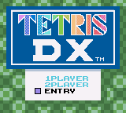

# Tutorial #6 – If/Else
## Overview 
This tutorial will show a few examples of how to create achievements using the **logical constructs** **If** and **Else**. [Tetris DX](https://retroachievements.org/game/4939) was chosen since it has a couple of achievements in the set that test for a certain puzzle pattern.   The examples show a method of creating these test patterns using a two-dimensional array and **logical constructs**.  They also show how you can make functions more versatile with **logical constructs**. If you are unfamiliar with the concept of **logical constructs** then please review the Khan Academy videos [If/Else - Part 1](https://www.khanacademy.org/computing/computer-programming/programming/logic-if-statements/pt/ifelse-part-1) and [If/Else - Part 2](https://www.khanacademy.org/computing/computer-programming/programming/logic-if-statements/pt/ifelse-part-2).<br>
<br> 
## Logical Constructs
**Logical constructs** allow you to control which blocks of code are executed.  The block of code that gets executed depends on value of the test condition. The test condition must be a **Boolean** value meaning the result is either **true** or **false**.  The *RATools* wiki has more information on how to use [Logical Constructs](https://github.com/Jamiras/RATools/wiki/Logical-Constructs).  For the following example assume a *number* that is randomly selected between 0 and 10. Depending on the value of the *number* different blocks of the code will be executed if number is between less than 5 or greater than or equal to 5.
```
if (number < 5)
{
    // Execute this block of code if the number is less than 5
}
else
{
    // Execute this block of code if the number is greater than or equal to 5
}
```
Note that if the block of code is only one line the curly brackets can be omitted. You can also omit the **else** clause altogether if it's not needed.  The **else** and **if** clauses can be chained together to make more complicated conditionals.  For the following example assume a *number* that is randomly selected between 0 and 3.  To execute a different block of code for each *number*:
```
if (number == 0)
    // Execute this block of code if the number is 0
else if (number == 1)
    // Execute this block of code if the number is 1
else if (number == 2)
    // Execute this block of code if the number is 2
else if (number == 3)
    // Execute this block of code if the number is 3
```
## Compile Time vs. Runtime
A very important thing to note about **logical constructs** in *RAScripts* is that they are **Compile Time** operations!  Being **Compile Time** means that the *RAScript* code is ran once in *RATools* where it is translated into the achievement code used by *RALibretro* and other emulators. As a result, you **cannot** used emulation memory values for **logical constructs** since that memory does not exist when the *RAScript* is compiled. Conversely, the achievement code is ran at **Runtime** meaning that it is ran with the emulator and has access to the emulator’s memory values.  This might be a confusing point if you are new to the world of programming, just know that if you are having an issue with a **logical construct** it may be that you are trying to access emulator memory with it.

### Links
Tutorial #6<br>
[Example #6A](Example_6A.md)<br>
[Example #6B](Example_6B.md)<br>
[Example #6C](Example_6C.md)
