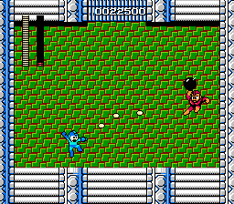

# Example #7A: Blue Bomber
Mega Man is one of the earliest games to give the player the freedom of playing the stages in any order.  When the player defeats a boss they acquire the boss’s special weapon which they can use for the rest of the game.  Every boss has a weakness to one of the special weapons so there is an optimal order to beating each stage which will make the game easier.  However, you do not need to exploit the boss’s weakness since every boss can be defeated using the default weapon, the Mega Buster.  Bombman is one of the easier bosses to beat which is why he was chosen for the damageless example.  Note the achievement can easily be modified for any of the other five bosses by changing the stage number and where the ready room is in the level.<br>
<br>
```
// Mega Man
// #ID = 1448

// $001B: Universal stage scrolling progress big parts
function StageBombmanBoss() => byte(0x00001B) == 22

// $0031: Stage id
function StageID() => byte(0x000031)

// $0041: Solid pause
function SolidPause() => byte(0x000041) == 1

// $006A: Health
function Health() => byte(0x00006A)

// $00BB: Stage clear flag
function StageClear() => byte(0x0000BB) == 1

// Start at the beginning of the Bombman boss fight
bombmanDamagelessStart = once(StageBombmanBoss() && StageID() == 2)

// Cancel if on the stage select screen, health lost, or the pause glitch used
bombmanDamagelessCancel = never(StageSelect()) && 
    never(Health() < prev(Health())) &&
    never(SolidPause())

// Submit when the stage is cleared
bombmanDamagelessSubmit = trigger_when(StageClear())

achievement(
    title = "Example 7A: Blue Bomber",
    description = "Defeat Bombman without taking damage (pause glitch not allowed)", 
    points = 10,
    trigger = bombmanDamagelessStart && bombmanDamagelessCancel && bombmanDamagelessSubmit
)
```
## Start Conditions
The challenge is set to begin when the player enters the boss’s ready room right before the fight.  To keep the **challenge indicator** active during the fight a ```once()``` command records a hit while in the ready room.  It is important the condition used to start the challenge does not occur during the challenge.  If the start condition occur during the bosses fight the challenge may be restarted even if the player has taken damage.  For damageless challenges like this it is ideal to have the start condition occur in-between the end of the level and before the boss fight.
## Cancel Conditions
The challenge will cancel if the player is on the stage selection screen, takes damage, or pauses the game.  Each of these cancel conditions use a ```never``` command to reset the hit recorded during the start condition, thus removing the **challenge indicator** and blocking the player from getting the achievement if they beat the boss.  The cancel condition for taking damage is self-explanatory however the other two cancel conditions might not be so obvious.  Canceling when we are at the stage select screen will reset the challenge if the player returns to the stage select screen for any reason.  Canceling on pause is game specific, Mega Man has an infamous glitch that allows the enemy damage cool down timer to continue counting down while the game is paused.  The result is that you can hit an enemy multiple times with one shot if you mash the pause button while the projectile is over them.  By canceling on pause we don’t give the player credit for beating the boss with the pause glitch.
## Submit Conditions
The challenge will be triggered when the submit conditions are true.  The submit conditions use a ```trigger_when()``` command to add a trigger flag to this condition.  Since the boss beat flag is the last condition to be met, putting a trigger flag on that condition will cause a **challenge indicator** to appear while fighting the boss.  It is important that the submit conditions do not occur until the boss is defeated or the achievement will trigger prematurely.<br>
<br>
Scripts: [Example #7A script](Example_7A_Mega_Man.rascript) <br>
### Links
[Tutorial #7](readme.md) <br>
Example #7A<br>
[Example #7B](Example_7B.md) <br>
[Example #7C](Example_7C.md) <br>