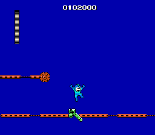

# Example #7B: MM1 Survivalist I (Bombman)
Mega Man is a difficult game that relies on quick reaction time, knowledge of enemy patterns, and memorization of the order for disappearing blocks.  However, the game has very little Random Number Generation (RNG) so once you learn a pattern it will be the same the next time.  Despite its difficulty, completing a stage without dying is a reasonable challenge that most players can complete with a little practice.  Bombman has one of the easier stages to beat which is why he was chosen for the deathless stage example.   Like the damageless challenge, this achievement can easily be modified for any of the other five bosses by changing the stage number on the start condition.
 
<br>
```
// Mega Man
// #ID = 1448

// $001B: Universal stage scrolling progress big parts
function StageStart() => byte(0x00001B) == 1

// $0031: Stage id
function StageID() => byte(0x000031)

// $0036: [8-bit] Stage Select (0xbd when selecting stage)
function StageSelect() => byte(0x000036) == 0xbd

// $0041: Solid pause
function SolidPause() => byte(0x000041) == 1

// $0071: Ammount of Magnet Beam left
function MagnetBeamAmmo() => byte(0x000071)

// $00A6: Lives
function Lives() => byte(0x0000A6)

// $00BB: Stage clear flag
function StageClear() => byte(0x0000BB) == 1

// Start at the beginning of the stage
bombmanDeathlessStart = once(StageStart() && StageID() == 2)

// Cancel if on stage selection screen, life lost, pause glitch used, or magnet gun used
bombmanDeathlessCancel = never(StageSelect()) && 
    never(prev(Lives()) > Lives()) &&
    never(SolidPause()) && 
    never(prev(MagnetBeamAmmo()) > MagnetBeamAmmo())

// Submit when the stage is cleared
bombmanDeathlessSubmit = trigger_when(StageClear())

achievement(
    title = "Example 7B: MM1 Survivalist I (Bombman)", 
    description = "Complete Bombman's Stage without losing a life, pausing, or Magnet Beam (Weapon Menu is OK)", 
    points = 5,    
    trigger = bombmanDeathlessStart && bombmanDeathlessCancel && bombmanDeathlessSubmit
) 
```
## Start Conditions
The challenge is set to begin when the player is at the beginning of Bombman’s stage.  To keep the **challenge indicator** active during the stage a ```once()``` command records a hit while on the first screen of the stage.  The challenge will restart if the player dies early in the stage since they will be spawned back at the beginning.  Once the player gets past the first check point they will have to survive until they beat Bombman or they will fail the challenge and have to restart the stage from the beginning.
## Cancel Conditions
The challenge is cancelled by changing the stage, losing a life, pausing the game, or using the Magnet Beam weapon. Each of these cancel conditions use a ```never``` command to reset the hit from the start condition, thus removing the **challenge indicator** and blocking the player from getting the achievement if they beat the stage.  Obviously, if the player loses a life the challenge is canceled.  Similar to [Example 7A](Example_7A.md), the achievement is canceled when the player returns to the stage select screen for any reason.  The achievement is also reset if the player abuses the pause glitch to get through the level.  The Magnet Beam is a special weapon that creates a temporary platform that the player can use to avoid tricky parts of the level. By canceling when the Magnet Beam ammo decrements we allow the player to accidently select the Magnet Beam without punishment while still limiting its use in the stage.
## Submit Conditions
Similar to [Example 7A](Example_7A.md), the achievement will trigger when the player beats Bombman while the hit from the start condition is still active.  If any of the cancel conditions occur during the challenge the achievement will be blocked when the player completes the stage.<br>
<br>
Scripts: [Example #7B script](Example_7B_Mega_Man.rascript) <br>
### Links
[Tutorial #7](readme.md) <br>
[Example #7A](Example_7A.md) <br>
Example #7B <br>
[Example #7C](Example_7C.md)