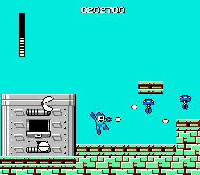

# Example #7C: Master of the Robot Busters (C)
One of the most impressive mechanics of the Mega Man formula is the fact that all six of the initial starting stages can be beat with the default weapon, the Mega Buster.  This is the main factor that allows the player the freedom to choose the stage order.  Some stages are harder to beat with the Mega Buster than others which is reflected in the amount of points rewarded.  The Mega Buster challenge is a staple of every Mega Man set.
  
## Homework #7
Using similar logic from [Example 7A](Example_7A.md) and [Example 7B](Example_7B.md) create an achievement to beat Cutman’s stage (ID 0) using only the Mega Buster (pause glitch is allowed for this achievement).
## Mega Weapons
To complete the homework problem you’ll need the following memory addresses for all of the Mega Weapons.
| Address | Weapon Type         |
|:-------:|---------------------|
| $006B   | Rolling Cutter Ammo |
| $006C   | Ice Slasher Ammo    |
| $006D   | Hyper Bomb Ammo     |
| $006E   | Fire Storm Ammo     |
| $006F   | Thunder Beam Ammo   |
| $0070   | Power Arm Ammo      |
| $0071   | Magnet Beam Ammo    |
 
### Solution
Solution: [Tutorial #7 Solution](./Solution/readme.md) 
### Links
[Tutorial #7](readme.md) 
[Example #7A](Example_7A.md) 
[Example #7B](Example_7B.md) 
Example #7C