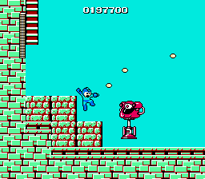

# Tutorial #7 Solution
For this example the player must complete Bombman’s stage only using the Mega Buster.<br> 
<br>
```
// Mega Man
// #ID = 1448

// $001B: Universal stage scrolling progress big parts
function StageStart() => byte(0x00001B) == 1

// $0031: Stage id
function StageID() => byte(0x000031)

// $0036: [8-bit] Stage Select (0xbd when selecting stage)
function StageSelect() => byte(0x000036) == 0xbd

// $006B: Amount of Rolling Cutter left
function RollingCutterAmmo() => byte(0x00006B)

// $006C: Amount of Ice Slasher left
function IceSlasherAmmo() => byte(0x00006C)

// $006D: Amount of Hyper Bomb left
function HyperBombAmmo() => byte(0x00006D)

// $006E: Amount of Fire Storm left
function FireStormAmmo() => byte(0x00006E)

// $006F: Amount of Thunder Beam left
function ThunderBeamAmmo() => byte(0x00006F)

// $0070: Amount of Power Arm left
function PowerArmAmmo() => byte(0x000070)

// $0071: Amount of Magnet Beam left
function MagnetBeamAmmo() => byte(0x000071)

// $00BB: Stage clear flag
function StageClear() => byte(0x0000BB) == 1

// Start at the beginning of the stage
bombmanBusterStart = once(StageStart() && StageID() == 2)

// Cancel if on stage selection screen or any weapon other than the Mega Buster is used
bombmanBusterCancel = never(StageSelect()) && 
    never(prev(RollingCutterAmmo()) > RollingCutterAmmo()) && 
    never(prev(IceSlasherAmmo()) > IceSlasherAmmo()) && 
    never(prev(HyperBombAmmo()) > HyperBombAmmo()) &&
    never(prev(FireStormAmmo()) > FireStormAmmo()) && 
    never(prev(ThunderBeamAmmo()) > ThunderBeamAmmo()) &&
    never(prev(PowerArmAmmo()) > PowerArmAmmo()) &&    
    never(prev(MagnetBeamAmmo()) > MagnetBeamAmmo())

// Submit when the stage is cleared
bombmanBusterSubmit = trigger_when(StageClear())

achievement(
    title = "Example 7C: Master of the Robot Busters (B)",
    description = "Play through the whole Bombman's Stage using only Mega Buster",
    points = 10,
    trigger = bombmanBusterStart && bombmanBusterCancel && bombmanBusterSubmit
)
```
## Start Conditions
Similar to [Example 7B](../Example_7B.md), the start condition occurs when the player is at the beginning of Bombman’s stage.
## Cancel Conditions
The challenge is cancelled when the player is on the level select screen or when the player uses ammo from any weapon other than the Mega Buster.  Note that unlike the previous examples the player can use as many lives as necessary and the pause glitch is allowed. However, if the player gets a game over they will be sent back to the stage select screen and the challenge will be canceled.
## Submit Conditions
All of the examples trigger when the boss is defeated so long as the hit from the start conditions has not been reset.<br>
<br>
[Complete Example #7C with the above solution](Example_7C_Mega_Man.rascript)<br>
### Links
[Tutorial #7](../readme.md)<br>
[Example #7A](../Example_7A.md)<br>
[Example #7B](../Example_7B.md)<br>
[Example #7C](../Example_7C.md)