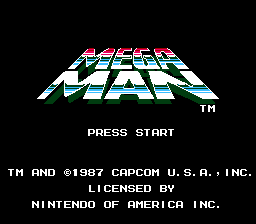

# Tutorial #7 – Challenges Part 1
## Overview
This tutorial will show a few examples of how to create deathless, damageless, and weapon limited challenge achievements. A second tutorial is planned afterwards to cover speedruns and other time related challenges.  The topic of challenge achievements is very broad and what challenges are appropriate for a game are completely dependent on the game mechanics.  The game [Mega Man](https://retroachievements.org/game/1448) was chosen for this tutorial because it is a tough yet fair game that has very little Random Number Generator (RNG) events which could mess up a damageless/deathless run.  With enough practice, skill, game mechanic knowledge, and patience damageless runs of the entire game are achievable (see [Mr. Perfect](https://retroachievements.org/achievement/53290) from the [Mega Man Bonus](https://retroachievements.org/game/6729) set). <br>
<br> 

## Challenge Indicators
**Challenge indicators** will appear on the screen when a player is close to obtaining an achievement.  The achievement will also appear as **primed** when the player opens up the Retro Achievement overlay.  An achievement is considered **primed** when all of the conditions, except for the conditions with a **trigger** flag on them, have been met.  **Challenge indicators** give feedback to the player of when an achievement is still achievable and, more importantly, when a challenge has been failed.  It is good practice to keep the number of primed achievements to a minimum to reduce visual clutter. <br>
For example, a damageless boss achievement should only be **primed** while fighting the boss.  If the player takes damage the **challenge indicator** should disappear to let the player know they failed the challenge and won’t receive the achievement for this fight.  The challenge achievement should not appear again until the player goes for a rematch with the boss. Similarly, a deathless level achievement should only be **primed** during the challenge level.  If the player dies during the level the **challenge indicator** should disappear until the player retires the level in a different play through. We will go more in-depth with the following Mega Man examples to show how to code challenges with RAScripts.
## Leaderboard Analogy
This tutorial will use leaderboard terminology for the different types of conditions used in a challenge.  We will cover how to script leaderboards in a later tutorial with an eventual goal of making synchronized challenge achievements and leaderboards that start, cancel, and submit with the same code.  
### Start 
The start condition for a challenge achievement is an event that occurs right before the challenge has started.  This start event should not occur again during the challenge otherwise the challenge maybe restarted again prematurely if the player fails in the middle.  Use the ```once()``` around the start condition to add a hit that will keep the challenge active until it is reset or the  player completes the challenge.  A more complex start condition may require multiple conditions in an **AndNext** chain with a hit on the last condition which can be accomplish by wrapping the entire group of conditions in a ```once()```. Multiple start conditions can be coded by putting each start condition in its own Alt.
### Cancel
The cancel conditions for a challenge achievement are events that will reset the hit from the start condition.  The cancel condition will also remove the **challenge indicator** from the screen if the achievement was **primed**.  There will often be multiple cancel conditions for challenges like a game over, a level change, taking damage, losing a life, and any unique events for the challenge.  Each cancel condition should be wrapped in a ```never()``` command which adds a ResetIf flag to the condition. If a cancel event is multiple conditions then wrap all of the conditions in the ```never()``` command to create an AndNext chain.
### Submit
The submit condition for a challenge achievement is the event that occurs once the challenge has been completed.  If the start condition hit has not been reset by the cancel condition then the achievement will trigger when the submit conditions are met. Using the ```trigger_when()``` command for all of the submit conditions will put a trigger flag on each of the conditions. If a submit event is multiple conditions then wrap all of the conditions in the ``` trigger_when()``` command to create an AndNext chain.

### Links
Tutorial #7<br>
[Example #7A](Example_7A.md)<br>
[Example #7B](Example_7B.md)<br>
[Example #7C](Example_7C.md)