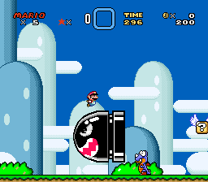

# Example #8A: Yoshi's Island 1 Speedrun
Yoshi’s Island 1 is the first level in Super Mario World and is one of the easiest levels to beat in the game.  The game gives you 300 seconds to complete the level however, once you reduce that time limit it becomes much more challenging.  When deciding on time limits for speedrun achievements be sure to add a small buffer of extra time to allow for a few mistakes.  Player’s can spend years perfecting a speedrun which is an unreasonable expectation for the average player.  Leave the world record times for leaderboards instead.<br>
<br>
```
// Super Mario World
// #ID = 228

// $0000CE: [3 byte] 24-bit pointer to level's sprite data
function LevelPointer() => tbyte(0x0000CE)

// $000100: Game mode. Anything 00 to 0a is title screen
//          Goes from 2314 to 2315 at new game start
function GameMode() => byte(0x000100)

// $000DB2: 2 player game flag
function Player2() => byte(0x000DB2) 

// $000DD5: Level Beat
//          [00] = Default value. 
//          [01] = Beat the level using the normal exit.
//          [02] = Beat the level using the secret exit. 
//          [80] = Exiting the level by using Start Select or by dying.
//          [E0] = Save prompt popup in the overworld.
//          Fun Fact: Donut Ghost House has normal and secret exit in reverse.
function LevelBeat() => byte(0x000DD5)

// $000F31: [3 bytes] Time (BCD)
function TimeX00() => byte(0x000F31)
function Time0X0() => byte(0x000F32)
function Time00X() => byte(0x000F33)
function Time() 
{
    return TimeX00() * 100 +
        Time0X0() * 10 +
        Time00X()
}

// $0013BF: 8-bit Level ID
function LevelID() => byte(0x0013BF)

// $0013CF: if = 40 player is entering stage from mid point
function MidPoint() => byte(0x0013CF)

// Shortcut for when a player starts a certain level
function StartLevel(level) 
{
    return GameMode() > 0xa &&
        Player2() == 0 &&
        LevelID() == level &&
        MidPoint() != 0x40 &&
        prev(LevelPointer()) == 0 &&
        LevelPointer() != 0
}

// Shortcut for completing a level (defaults to normal exit)
function ExitLevel(exit = 1)
{
    return prev(LevelBeat()) == 0 &&
        LevelBeat() == exit
}

// Speedrun challenge to complete the level parameter in under the time parameter
// Start: When the player start the level parameter
// Cancels: When the player returns to the world map, title screen, or time elapses
// Submits: When the player exits the level
function LevelSpeedrun(level, time)
{
    start = once(StartLevel(level))
        
    cancel = never(GameMode() == 0) &&
        never(LevelPointer() == 0) &&
        never(Time() < time)
    
    submit = trigger_when(ExitLevel())
    
    return  start && cancel && submit
}

achievement(
     "Example #8A - Yoshi's Island 1 Speedrun",
     "Complete Yoshi's Island 1 in under 240 seconds",
     0,
     LevelSpeedrun(0x29, 240)
)
```
### Start 
The start condition for this challenge occurs when the player starts Yoshi’s Island 1 from the beginning in single player mode.  It’s worth noting that most levels have a checkpoint in the middle that, if the player hits the white tape between the midpoint goal posts, acts as a starting location when the player die’s before completing the level.  Starting from the midpoint would negate the speedrun challenge so the ```StartLevel(level)``` function only triggers when starting from the beginning of the level.  By using a shortcut function like ```StartLevel(level)``` we can easily change which level the achievement is coded for by changing the level ID parameter.
### Cancel
The cancel conditions for this challenge achievement are when the player leaves the level, a game over occurs, or the timer expires.  The achievement uses the level pointer to know when a player is in a level.  When the level is loaded the level pointer is not null (zero) and when the level is unloaded the pointer returns to null (zero).  In this case the pointer’s location is unimportant since we use the level ID to know which level is loaded.<br>
<br>
For games that include a level timer like Super Mario World it’s a good idea to use that timer for speedruns.  The player can check their progress with the in-game clock to know how much time they have left to finish the speedrun.  The time display is Binary Coded Decimal (BCD) so the code uses the function ```Time()``` to convert it to base 10 decimal.  If the game does not include a timer then you can create an internal timer which will be shown in the next example.
### Submit
The submit condition for this challenge achievement is when the player exits the level through a normal exit.  Some levels have two exits so we need to specify the type of exit.  The ```ExitLevel(exit)``` function is a shortcut which defaults to the normal exit if ```exit = 1``` and the secret exit if ```exit = 2```.  Note that this event will occur every time the player completes a level however, the achievement will only be awarded if the start condition hit is still active.<br>
<br>
Scripts: [Example #8A script](Example_8B_Super_Mario_World.rascript) <br>
### Links
[Tutorial #8](readme.md) <br>
Example #8A<br>
[Example #8B](Example_8B.md) <br>
[Example #8C](Example_8C.md) <br>