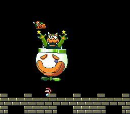

# Example #8B: World Speedrun
The ultimate goal of a speedrun is to complete a game in the shortest time possible.  Games often have shortcuts and optional items to collect so you can beat the game without 100% completing it.  At a minimum, Speedruns are categorized by either **100%** runs which required you to complete every level and collect every item, **Any%** runs which allow skipping levels and items, and **Glitch** runs which allow the player use any in-game glitch at their disposal. Depending on the game there are often many more types of speedruns to attempt.<br>
<br>
Super Mario World has a total of 96 normal and secret exits which, at the time of writing, took [oosui 1h 21m 17s 530ms to get the 100% world record](https://www.speedrun.com/smw/run/mkeo46xm).  This is a **very long time** to base an achievement on so a better candidate is the 11 Exit speedrun is which, at the time of writing, took [Tsuake 9m 42s 983ms for the world record](https://www.speedrun.com/smw/run/z0pk0wjy).  The 11 Exit is a glitchless run which requires you to take a shortcut through the Star World to skip ahead to Bowser’s Castle.  When adding a time buffer to a multi-level speedrun it’s a good idea to allow for several errors in each level.  Even with adding over six minutes to world record, this example would still be a huge challenge to beat for the average player.  Unless the game is very short a full game speedrun like this example would fit better in a **Bonus** set.<br>
<br>
 
```fsharp
// Super Mario World
// #ID = 228

// $000100: Game mode. Anything 00 to 0a is title screen
//          As a word is goes from 2314 to 2315 at new game start
function GameMode() => byte(0x000100)
function GameModeWord() => word(0x000100)

// $000DB2: 2 player game flag
function Player2() => byte(0x000DB2) 

// $0013BF: 8-bit Level ID
function LevelID() => byte(0x0013BF)

// $0013F9: Mario's layer (3 = game end)
function MariosLayer() => byte(0x13F9)

// $001F2E: Stages Cleared
function StagesCleared() => byte(0x001F2E)

// Shortcut for when a player starts a new game file
function NewGame() 
{
    return prev(GameModeWord()) == 2314 && 
        GameModeWord() == 2315 && 
        StagesCleared() == 0 && 
        Player2() == 0
}

// Shortcut for when a player beats bowser and wins the game
function EndGame()
{
    return StagesCleared() > 0 &&
        LevelID() == 49 && 
        MariosLayer() == 3 && 
        GameMode() == 2
}

// Converts the time minutes:seconds:frames to frames (NTSC = 1/60s, PAL = 1/50s)
function TimeSpanNTSC(minutes, seconds, frames) => minutes * 3600 + seconds * 60 + frames
function TimeSpanPAL(minutes, seconds, frames) => minutes * 3000  + seconds * 50 + frames

// Speedrun challenge to complete Super Mario World in under the time parameter
// Start: When the player creates a new game file
// Cancels: When the player returns to the title screen on time elapses
// Submits: When the player defeats bowser
function WorldSpeedrun(time)
{
    start = once(NewGame())
        
    cancel = never(GameMode() == 0) &&
        never(repeated(time, GameMode() > 0x0a))
    
    submit = trigger_when(EndGame())
    
    return  start && cancel && submit
}

achievement(
     "Example #8B - World Speedrun",
     "Defeat Bowser (front door) starting from a new save game file in under 16 minutes",
     0,
     WorldSpeedrun(TimeSpanNTSC(16,0,0))
)
```
### Start 
The start condition for this challenge occurs when the player starts a new game file.  The shortcut function ```NewGame()``` checks that no exits are cleared and that only one player is active when the game mode changes.
### Cancel
The cancel conditions for this challenge achievement are when a game over occurs or the internal timer expires.  Since Super Mario World does not have any overall timer we have setup a timer internal to the achievement code. The code ```never(repeated(time, GameMode() > 0x0a))``` will reset the achievement after the parameter ```time``` frames while player is in-game.  Note that both US and Japanese games are linked so we use the ```TimeSpanNTSC()``` function which converts the time to frames for a 60hz system.  If the linked version was from the Europe region then use the ```TimeSpanPAL()``` function which converts the time to frames for a 50hz system. As a rule the NTSC and PAL games should not be linked to the same set since players on a 50Hz system will have an advantage over players on a 60Hz system. 
### Submit
The submit condition for this challenge achievement is when the player beats bowser. The ```EndGame()``` checks that the player is on the final level when Mario changes layers during the end game cinematics.  The achievement specifies the **Front Door** entrance since it’s possible to enter Bowser’s Castle from the **Back Door** which skips the first half of the level. Note that an additional check is added that at least one exit has been cleared to ensure that the player didn’t use a glitch to skip to the end.<br>
<br>
Scripts: [Example #8B script](Example_8B_Super_Mario_World.rascript) <br>
### Links
[Tutorial #8](readme.md) <br>
[Example #8A](Example_8A.md) <br>
Example #8B <br>
[Example #8C](Example_8C.md)
