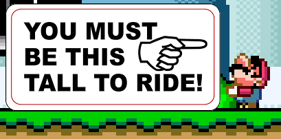

# Example #8C: Small Boy Challenge
The small boy challenge is to complete a level (or the whole game) without using a power up or riding Yoshi.  Super Mario World has power ups like the fire flower or the cape which can trivialize completing a level. For example, using the cape for the [Yoshi's Island 1 Speedrun](Example_8A.md) would make the challenge too easy since you can fly over the entire level. Additionally, being powered up gives Mario one more hit point therefore the small boy challenge is also a damageless challenge.  Being small does have an advantage, small Mario has a smaller hitbox meaning that small Mario can pass by obstacles that would hit a powered up Mario. 
 
## Homework #8
Using similar logic from [Example 8A](Example_8A.md) create an achievement to beat any level as small Mario and without Yoshi.
## Useful Memory
To complete the homework problem you’ll need the memory addresses: 
0x000019 -> [8-bit] Player's Power: 0 = Small, 1 = Super, 2 = Cape, 3 = Flower 
0x00187A -> [8-bit] Sitting on Yoshi: 0 = None, 1 = On Yoshi 2 = On Yoshi turning 
0x0013BF -> [8-bit] Level ID 
| ID | Level | ID | Level | ID | Level |
|:----:|-----------------------|:----:|-----------------------|:----:|-----------------------|
| 0x01 | Vanilla Secret 2      | 0x1B | Chocolate Fortress    | 0x38 | Valley Ghost House    |
| 0x02 | Vanilla Secret 3      | 0x1C | Chocolate Island 5    | 0x39 | Valley of Bowser 2    |
| 0x03 | Top Secret Area       | 0x1D | Chocolate Island 4    | 0x3A | Valley of Bowser 1    |
| 0x04 | Donut Ghost House     | 0x20 | Roy's Castle          | 0x3B | Chocolate Secret      |
| 0x05 | Donut Plains 3        | 0x20 | Iggy's Castle         | 0x3C | Vanilla Dome 2        |
| 0x06 | Donut Plains 4        | 0x21 | Choco-Ghost House     | 0x3D | Vanilla Dome 4        |
| 0x07 | Morton's Castle       | 0x22 | Chocolate Island 1    | 0x3E | Vanilla Dome 1        |
| 0x09 | Donut Plains 2        | 0x23 | Chocolate Island 3    | 0x40 | Lemmy's Castle        |
| 0x0A | Donut Secret 1        | 0x24 | Chocolate Island 2    | 0x41 | Forest Ghost House    |
| 0x0B | Vanilla Fortress      | 0x26 | Yoshi's Island 4      | 0x42 | Forrest of Illusion 1 |
| 0x0C | Butter Bridge 1       | 0x27 | Yoshi's Island 3      | 0x43 | Forrest of Illusion 4 |
| 0x0D | Butter Bridge 2       | 0x29 | Yoshi's Island 1      | 0x44 | Forrest of Illusion 2 |
| 0x0E | Ludwig's Castle       | 0x2A | Yoshi's Island 2      | 0x46 | Forrest Secret Area   |
| 0x0F | Cheese Bridge Area    | 0x2B | Vanilla Ghost House   | 0x47 | Forrest of Illusion 3 |
| 0x10 | Cookie Mountain       | 0x2D | Vanilla Secret 1      |      |                       |
| 0x11 | Soda Lake             | 0x2E | Vanilla Dome 3        |      |                       |
| 0x13 | Donut Secret House    | 0x2F | Donut Secret 2        |      |                       |
| 0x15 | Donut Plains 1        | 0x33 | Valley of Bowser 4    |      |                       |
| 0x18 | Sunken Ghost Ship     | 0x37 | Valley of Bowser 3    |      |                       |
| 0x1A | Wendy's Castle        | 0x38 | Valley Ghost House    |      |                       |

### Solution
[Tutorial #8 Solution](./Solution/readme.md) 
### Links
[Tutorial #8](readme.md) 
[Example #8A](Example_8A.md) 
[Example #8B](Example_8B.md) 
Example #8C
