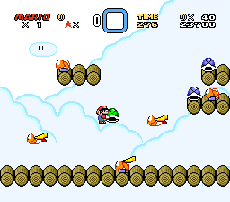

# Example #8C - Butter Bridge 2 Small Boy Challenge
Butter Bridge 2 was chosen for this example since it’s a more challenging level to do as small Mario.  This example is very similar to [Yoshi's Island 1 Speedrun](..\Example_8A.md) with the main difference that the cancel code has the additional conditions that Mario must be small and not riding Yoshi. <br>
<br>
```fsharp
// Super Mario World
// #ID = 228

// $000019: Player's Power: 00=Small, 01=Super, 02=Cape, 03=Flower
function PowerUp() => byte(0x000019)

// $0000CE: [3 byte] 24-bit pointer to level's sprite data
function LevelPointer() => tbyte(0x0000CE)

// $000100: Game mode. Anything 00 to 0a is title screen
//          Goes from 2314 to 2315 at new game start
function GameMode() => byte(0x000100)

// $000DB2: 2 player game flag
function Player2() => byte(0x000DB2) 

// $000DD5: Level Beat
//          [00] = Default value. 
//          [01] = Beat the level using the normal exit.
//          [02] = Beat the level using the secret exit. 
//          [80] = Exiting the level by using Start Select or by dying.
//          [E0] = Save prompt popup in the overworld.
//          Fun Fact: Donut Ghost House has normal and secret exit in reverse.
function LevelBeat() => byte(0x000DD5)

// $000F31: [3 bytes] Time (BCD)
function TimeX00() => byte(0x000F31)
function Time0X0() => byte(0x000F32)
function Time00X() => byte(0x000F33)
function Time() 
{
    return TimeX00() * 100 +
        Time0X0() * 10 +
        Time00X()
}

// $0013BF: 8-bit Level ID
function LevelID() => byte(0x0013BF)

// $0013CF: if = 40 player is enterting stage from mid point
function MidPoint() => byte(0x0013CF)

// $00187A: Sitting on Yoshi 3. Most accurate flag. 1=on yoshi 2=on yoshi turning
function OnYoshi() => byte(0x00187A)

// Shortcut for when a player starts a certian level
function StartLevel(level) 
{
    return GameMode() > 0xa &&
        Player2() == 0 &&
        LevelID() == level &&
        MidPoint() != 0x40 &&
        prev(LevelPointer()) == 0 &&
        LevelPointer() != 0
}

// Shortcut for completing a level (defaults to normal exit)
function ExitLevel(exit = 1)
{
    return prev(LevelBeat()) == 0 &&
        LevelBeat() == exit
}

// Speedrun challenge to complete the level parameter in under the time parameter as small Mario
// Start: When the player start the level parameter
// Cancels: When the player returns to the world map, title screen, time elapses, powers up, or is riding Yoshi
// Submits: When the player exits the level
function SmallBoySpeedrun(level, time)
{
    start = once(StartLevel(level))
        
    cancel = never(PowerUp() != 0) &&
        never(OnYoshi() != 0) &&
        never(GameMode() == 0) &&
        never(LevelPointer() == 0) &&
        never(Time() < time)
    
    submit = trigger_when(ExitLevel())
    
    return  start && cancel && submit
}

achievement(
     "Example #8C - Butter Bridge 2 Small Boy Challenge",
     "Complete Butter Bridge 2 with 255 or more seconds left as small Mario (no Yoshi)",
     0,
     SmallBoySpeedrun(0xD, 255)
)
```
### Start 
The start condition for this challenge occurs when the player starts Butter Bridge 2 from the beginning.  The start condition will not trigger if the player starts from the middle.  The shortcut function ```StartLevel(level)``` is useful since we change which level the achievement is coded for by changing the level id parameter.
### Cancel
Like Example #8A, the cancel conditions for this challenge are when the player leaves the level, a game over occurs, or the timer expires. Since it’s a Small Boy challenge the achievement will cancel if Mario powers up or starts riding Yoshi.
### Submit
The submit condition for this challenge achievement is when the player exits the level through a normal exit.  As mentioned earlier, some levels have two exits so we need to specify the type of exit.  The ```ExitLevel(exit)``` function is a shortcut which defaults to the normal exit if ```exit = 1``` and the secret exit if ```exit = 2```.<br>
<br>
[Complete Example #8C with the above solution](Example_8C_Super_Mario_World.rascript)<br>
### Links
[Tutorial #8](../readme.md)<br>
[Example #8A](../Example_8A.md)<br>
[Example #8B](../Example_8B.md)<br>
[Example #8C](../Example_8C.md)