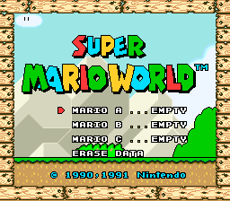

# Tutorial #8 – Challenges Part 2

## Overview
This tutorial will show a few examples of how to create speedruns and other time related challenges.  This is the second tutorial on challenges and it will build on the concepts introduced in tutorial #7. [Super Mario World](https://retroachievements.org/game/228) was chosen for this tutorial because it is a platforming game where you can replay levels after they are beaten making it perfect for reattempting a speedrun. Additionally, the game can be completed quickly by using secret exits to bypass the standard progression route making it possible to quickly jump to the final confrontation with Bowser. 
  
 
## Leaderboard Analogy
Similar to the last tutorial will use leaderboard terminology for the different types of conditions used in a challenge. Each achievement will have a **start**, **cancel**, and **submit** events that control when the achievement is primed. For more information on these events refer to the [previous tutorial](../07_Challenges_Part_1/readme.md).
### Start 
The start condition for a challenge achievement is an event that occurs right before the challenge has started.  
### Cancel
The cancel conditions for a challenge achievement are events that will reset the hit from the start condition.
### Submit
The submit condition for a challenge achievement is the event that occurs once the challenge has been completed.
### Links
Tutorial #8 
[Example #8A](Example_8A.md) 
[Example #8B](Example_8B.md) 
[Example #8C](Example_8C.md)