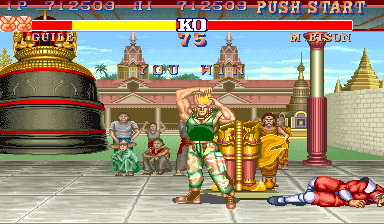

# Example #9A: Street Fighter II 1CC
To beat the game and become a **World Warrior** you must defeat all of the other seven playable and four boss fighters. The challenge for this achievement is to beat all the fighters in a row without losing a fight. This is a hard achievement since the difficulty ramps up quickly as you progress through the fighters.  Additionally, the computer cheats by being able to perform moves faster, or in some cases, impossible for a human player.  If you ever got stuck on a fighter in the past don’t feel bad, the computer wasn’t playing fair.<br>
<br>
 
```
// Street Fighter II: The World Warrior
// #ID = 11808

// $82DB: Attract mode flag
function AttractMode() => byte(0x0082DB)
function AttractActive() => AttractMode() == 1

// $8655: P1 Status (1 = Active)
function Player1Status() => byte(0x008655)
function Player1Active() => Player1Status() == 1

// $8955: P2 Status (1 = Active)
function Player2Status() => byte(0x008955)
function Player2Active() => Player2Status() == 1

// $89CC: Defeated CPU opponents 0b=ending
function DefeatedOpponents() => byte(0x0089CC)

// Challenge to beat the game without using a continue
function Beat1CC()
{
    // Start when player 1 starts the 1st fight
    start = once(Player1Active() && 
        DefeatedOpponents() == 0)    
    
    // Cancel if the attract demo is on, player 2 starts, or player 1 loses a fight
    cancel = never(AttractActive()) && 
        never(Player2Active()) && 
        never(!Player1Active())
        
    // The goal is to beat all 12 fighters
    goal = DefeatedOpponents() == 0xb
    
    // Trigger when the player reaches the goal
    submit = trigger_when(goal)
        
    // Measure how close the player is to the goal
    value = measured(goal)
    
    return start && cancel && (submit || value)
}

achievement(
    title = "Example #9A: Street Fighter II 1CC", 
    description = "Beat the game using only one credit", 
    points = 25,
    trigger = Beat1CC()
)
```
## Start
The achievement uses ```once()``` to add a hit when player one starts the first fight.  The hit will prime the achievement to show the trigger indicator until the **cancel** or **goal** events occur.
## Cancel
The achievement uses ```never()``` to remove the hit from the **start** event when the attract demo is on, player two starts playing, or player one loses a fight.
## Goal
The **goal** requirements are satisfied when the player beats the final boss, M. Bison (or Vega in the Japan region). The code then defines the **submit** event by wrapping the **goal** event in the ```trigger_when()``` function.  Similarly, the **value** event is created by wrapping the same **goal** event in the ``` measured()``` function.  By coding the achievement this way the trigger will continue to show the indicator until the player loses a fight and the achievement overlay will show how many more fights the player has left to win to earn the achievement.
## Coding Alts
When the function ```Beat1CC()``` returns the generated code to the achievement trigger it builds the code using the or operator ```||``` to place the **submit** event in one alt and the **value** event in a second alt.<br>
```
return start && cancel && (submit || value)
```
Note the parenthesis around the **submit** and **value** events.  The parenthesis separates the alt events from the core which will only contain the **start** and **cancel** events.<br>
### Script
Scripts: [Example #9A script](Street_Fighter_II_The_World_Warrior_Example_9A.rascript) <br>
### Links
[Tutorial #9](readme.md) <br>
Example #9A<br>
[Example #9B](Example_9B.md) <br>
[Example #9C](Example_9C.md) <br>