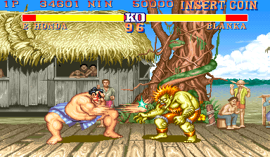

# Example #9B: Kimarite
Every character in Street Fighter II has a unique move set of special moves to match there fighting style (except for Ken and Ryu since they were both taught to fight by the same master).  The Sumo wrestler E. Honda has a very powerful special move call the Hundred Hand Slap where his hands slap so fast that they start to blur on the screen.  This special move is easy to perform by rapidly pressing any of the three punch buttons. The goal of this achievement is to hit the opponent 4 times only using the Hundred Hand Slap. <br>
<br>
 
```
// Street Fighter II: The World Warrior
// #ID = 11808

// $8008: Event
//        0a=during fight
function Event() => byte(0x008008)

// $82DB: Attract mode flag
function AttractMode() => byte(0x0082DB)
function AttractActive() => AttractMode() == 1

// $83F1: P1 KO flag
function Player1Flag() => byte(0x0083F1)
function Player1KO() => Player1Flag() == 255

// $8547: P1 attack buffer (Honda and Blanka)
function Player1AttackBuffer() => byte(0x8547)

// $8656: P1 Character
function Player1Character() => byte(0x008656)
Ryu = 0
EHonda = 1
Blanka = 2
Guile = 3
Ken = 4
ChunLi = 5
Zangief = 6
Dhalsim = 7

// $86F0: P2 HP
function Player2Health() => byte(0x0086F0)

// $86F1: P2 KO flag
function Player2Flag() => byte(0x0086F1)
function Player2KO() => Player2Flag() == 255

// $8955: P2 Status (1 = Active)
function Player2Status() => byte(0x008955)
function Player2Active() => Player2Status() == 1

// $8AE2: P1 number of attacks done during the round (except Zangief)
function Player1Attacks() => byte(0x008AE2)

// Challenge to hit the oponent 4 times with Hundred Hand Slap and nothing else
function Kimarite()
{
    // Start at the beginning of a round when the fight event changes to 0xa and the player has no hits
    start = once(Player1Attacks() == 0 &&
        prev(Event()) != 0xa &&
        Event() == 0xa)

    // Cancel if the attract demo is on, player 2 starts, player 1 is not E-Honda,
    // either player has been knocked out, or the player has landed an attack other than Hundred Hand Slaps
    cancel = never(AttractActive()) &&
        never(Player2Active()) && 
        never(Player1Character() != EHonda) &&
        never(Player1KO()) &&
        never(Player2KO()) &&
        never(
            prev(Player2Health()) > Player2Health() &&
            Player1AttackBuffer() != 51 && 
            Player1AttackBuffer() != 52 && 
            Player1AttackBuffer() != 53
        )
    
    // The goal is reaching 4 Hundred Hand Slaps without using any other attack
    goal = repeated(4, prev(Player2Health()) > Player2Health())
    
    // Trigger when the player reaches the goal
    submit = trigger_when(goal)
        
    // Measure how close the player is to the goal
    value = measured(goal)
    
    return start && cancel && (submit || value)
}

achievement(
    title = "Example #9B: Kimarite", 
    description = "Successfully hit the opponent 4 times with Hundred Hand Slap and nothing else", 
    points = 5,
    trigger = Kimarite()
)
```
## Start
The achievement uses ```once()``` to add a hit when player one starts any round.  The hit will prime the achievement to show the trigger indicator until the **cancel** or **goal** events occur.
## Cancel
The achievement uses ```never()``` to remove the hit from the **start** event when the attract demo is on, player two starts playing, player one is not E-Honda, either player has been knocked out, or the player has landed an attack other than Hundred Hand Slap.  The final cancel condition is a little more complex and will cancel only when player two loses health while the attack in the attack buffer is not one of the three variations of the Hundred Hand Slap.
## Goal
The **goal** requirements are satisfied when the player hits the opponent with only four Hundred Hand Slaps.  Similarly to the last example, the **goal** is used with a ```trigger_when()``` function to create the **submit** event and used with the ```measured``` function to create the **value** event.<br>
<br>
Scripts: [Example #9B script](Street_Fighter_II_The_World_Warrior_Example_9B.rascript) <br>
### Links
[Tutorial #9](readme.md) <br>
[Example #9A](Example_9A.md) <br>
Example #9B <br>
[Example #9C](Example_9C.md)