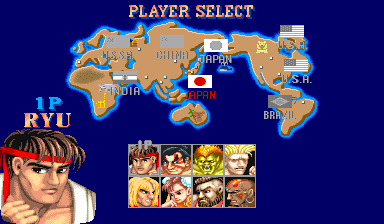

# Example #9C: One Character Beat
Street Fighter II has a total of eight playable characters to choose from.  Typically fighting game sets have a group of achievements for beating the game using each character.  These achievements are all very similar so you can take advantage of RATools to generate all these achievements using the same function.  
  
## Homework #9
Pick any fighter and make a function that will generate an achievement to beat the game using only that fighter.
## Useful Memory
To complete the homework problem you’ll need the memory address: 
0x008656 -> [8-bit] P1 Character 
| ID | Character |
|:----:|-----------------------|
| 0x0 | Ryu |
| 0x1 | E.Honda |
| 0x2 | Blanka |
| 0x3 | Guile |
| 0x4 | Ken |
| 0x5 | ChunLi |
| 0x6 | Zangief |
| 0x7 | Dhalsim | 
### Script
Solutions: [Tutorial #X Solution](./Solution/readme.md) 
### Links
[Tutorial #9](readme.md) 
[Example #9A](Example_9A.md) 
[Example #9B](Example_9B.md) 
Example #9C