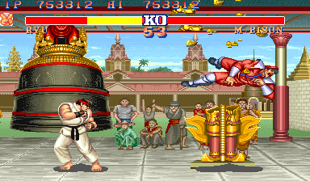

# Example #9C: Already Seeking The Next Challenge
This example is very similar to [Street Fighter II 1CC](../Example_9A.md) with the main difference that the cancel code allows only one fighter with infinite credits.  Ryu was chosen since he is one of the most iconic fighters in the series however, the code can easily be adapted for any fighter by changing the parameter. <br>
<br>
 
```
// Street Fighter II: The World Warrior
// #ID = 11808

// $82DB: Attract mode flag
function AttractMode() => byte(0x0082DB)
function AttractActive() => AttractMode() == 1

// $8655: P1 Status (1 = Active)
function Player1Status() => byte(0x008655)
function Player1Active() => Player1Status() == 1

// $8656: P1 Character
function Player1Character() => byte(0x008656)
Ryu = 0
EHonda = 1
Blanka = 2
Guile = 3
Ken = 4
ChunLi = 5
Zangief = 6
Dhalsim = 7

// $8955: P2 Status (1 = Active)
function Player2Status() => byte(0x008955)
function Player2Active() => Player2Status() == 1

// $89CC: Defeated CPU opponents 0b=ending
function DefeatedOpponents() => byte(0x0089CC)

// Challenge to beat the game with a certain character
function CharacterBeat(character)
{
    // Start when player 1 starts the 1st fight
    start = once(Player1Active() && 
        DefeatedOpponents() == 0)
        
    // Cancel if the attract demo is on, player 2 starts, or player 1 is not the correct character
    cancel = never(AttractActive()) && 
        never(Player2Active()) && 
        never((Player1Character() != character && 
            Player1Active()))
        
    // The goal is to beat all 12 fighters
    goal = DefeatedOpponents() == 0xb
    
    // Trigger when the player reaches the goal
    submit = trigger_when(goal)
        
    // Measure how close the player is to the goal
    value = measured(goal)
    
    return start && cancel && (submit || value)
}

achievement(
    title = "Example #9C: Already Seeking The Next Challenge",
    description = "Beat the game using Ryu only.",
    points = 10,
    trigger = CharacterBeat(Ryu)
)
```
## Start
The achievement uses ```once()``` to add a hit when player one starts the first fight using Ryu.  The hit will prime the achievement to show the trigger indicator until the **cancel** or **goal** events occur.
## Cancel
The achievement uses ```never()``` to remove the hit from the **start** event when the attract demo is on, player two starts playing, or player one is not using Ryu during a fight.  Note that the player can move the selection cursor around to other fighters however, the cancel event will occur if they are actively fighting with another fighter.
## Goal
The **goal** requirements are satisfied when the player beats the final boss, M. Bison (or Vega in the Japan region). Similar to the previous examples, the **goal** is used with a ```trigger_when()``` function to create the **submit** event and used with the ```measured``` function to create the **value** event.<br>
### Script
[Complete Example #9C with the above solution](Street_Fighter_II_The_World_Warrior_Example_9C.rascript)<br>
### Links
[Tutorial #9](../readme.md)<br>
[Example #9A](../Example_9A.md)<br>
[Example #9B](../Example_9B.md)<br>
[Example #9C](../Example_9C.md)