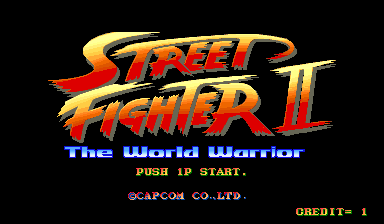

# Tutorial #9 – Trigger and Measure Together
## Overview
This tutorial will show a few examples of how to create an achievement that uses both the trigger and measure flags together.  The game [Street Fighter II: The World Warrior](https://retroachievements.org/game/11808) was chosen for this tutorial because it is a fighting game that counts both the number of fights you have won and the type of attacks made.  These types of in game statistics work well for showing both what challenges are active and how far the player has gotten into the challenge. You could code it with just triggers however, by adding a measure the player gets both on screen notifications of when the achievement is primed as well as feedback of how far along they are to achieving the challenge.<br>
<br> 
## Trigger and Measure flag Together at Last
The **trigger** and **measure** flags conflict with each other and cannot exist together in the core or in an alt.  This is because you can only put one flag on a line of code at a time.  To use **trigger** and **measure** together you must put them each in separate alts.  The best way to use both flags together is to make a **goal** event that triggers when the player has successfully completed the achievement requirements. Then wrap the **goal** in a ```trigger_when()``` in the first alt and wrap the same **goal** in a ```measured()``` in the second alt.  The following examples will show how to use both flags using a similar method to coding challenges from the previous tutorials.
### Links
Tutorial #9<br>
[Example #9A](Example_9A.md)<br>
[Example #9B](Example_9B.md)<br>
[Example #9C](Example_9C.md)