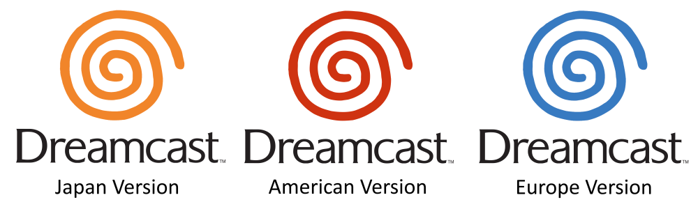

# Example #10A: Region Detection
Disc based systems gives each release a unique name that can be used to detect which region the player is using.  The name for the disc is often found in the same region of memory used by the operating system to help identify the game.  Rez has a Japanese release named “HDR-0178” and a European/North American released named “MK-5119250” which are both found at 0x8040.  If you can find the disc name for your game online then you can search for it in the memory inspector using the “ASCII Text” filter. The Developer Documentation has some [console specific tips](https://docs.retroachievements.org/Console-Specific-Tips/#playstation) of where you would find the disc name for PlayStation games.<br>
<br> 
```
// Rez
// #ID = 3419

// $008040: [ASCII] Name of the GD-ROM disc in drive:
//          JPN = "HDR-0178"
//          US/EU = "MK-5119250"
function GDROM(offset = 0) => 0x8040 + offset

//-------------------------------------------------------------------------
// Helper Functions

// Check if the string hex values equal the hex values at the passed address
function StringCompare(address, string)
{
    return all_of(range(0, length(string) - 1), i => byte(address + i) == string[i])
}

// "HDR-0178" = Japan GD-ROM Name
JapanDisc = [0x48,0x44,0x52,0x2D,0x30,0x31,0x37,0x38]

// "MK-5119250" = EU GD-ROM Name
EuDisc = [0x4D,0x4B,0x2D,0x35,0x31,0x31,0x39,0x32,0x35,0x30]

achievement(
    "Example #10A - Japan Region",
    "Start the game with the Japan region disc",
    0,
    StringCompare(GDROM(), JapanDisc)
)

achievement(
    "Example #10A - EU Region",
    "Start the game with the EU region disc",
    0,
    StringCompare(GDROM(), EuDisc)
)
```
## Converting ASCII to hexadecimal
You could convert an ASCII string to hexadecimal using a table however, that is both time consuming and error prone.  If you have several strings to convert there are many online websites that will do the conversion for you like the [Online Hex Tools](https://onlinehextools.com/convert-ascii-to-hex).

## StringCompare
The function StringCompare is passed the starting memory **address** of where the disc name is and an array of the expected hexadecimal values at that location.  The function uses all_of() to iterate through the array and creates a condition for each letter in order.  As the function iterates through the array it also iterates through the memory looking for a one to one match with the values in the array.  Note that strings are case sensitive since capital ‘A’ does not have the same value as lowercase ‘a’.<br>
<br>
Scripts: [Example #10A script](REZ_Example_10A.rascript)<br>
### Links
[Tutorial #10](readme.md)<br>
Example #10A<br>
[Example #10B](Example_10B.md)<br>
[Example #10C](Example_10C.md)<br>