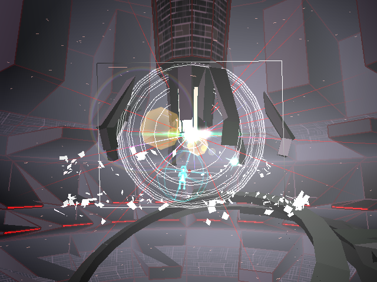

# Example #10B: Eden
In Rez you control a hacker named Swayzak who is trying to infiltrate a computer system to stop a corrupt AI named Eden.  The game is a hybrid rhythm rail shooter where the area and your shots are timed to the music to create a sense of synesthesia.  The background models for each area is an ASCII string so instead of looking at area numbers we are looking for a specific area name. The final area is where Swayzak confronts Eden after a gauntlet of bosses that are similar to the bosses in the previous four areas.  The example below uses the model name for the end movie after Eden is beat to detect the end of the game.<br>
<br>
 ```
// Rez
// #ID = 3419

// $201248: [8-bit] Immortal Cheat (0 = off, 1 = on)
function ImmortalCheat() => byte(0x201248)

// $201250: [8-bit] Overdrive Cheat (0 = off, 1 = on)
function OverdriveCheat() => byte(0x201250)

// $201270: [float] Boss Health
function BossHealth() => float(0x201270)

// $20C124: [ASCII] Current model loaded index 0
//          "eden_d5.pmm" = Form 5 of the final boss end movie
//          ... note rest of string notes removed for brevity, see online code notes for full list
function ModelLoaded(offset = 0) => 0x20C124 + offset

// $20d8d4: [8-bit] Game Type (0 = Travelling, 2 = How To Play, 3 = Play, 4 = Score, 5 = Beyond)
function GameType() => byte(0x20d8d4)

// $210AC4: [24-bit] Game Pointer (null in menu)
function GamePointer() => tbyte(0x210AC4)

// $28DE38: [8-bit] Area (0-9)
//          Areas = {0:"Area 1", 1:"Area 2", 2:"Area 3", 3:"Area 4",  4:"Area 5", 
//            5:"Area 5 Bosses", 6: "How to Play", 7:"Boss Rush", 8:"Lost Area", 9:"Trace Mission"}
function Areas() => byte(0x28DE38)

// $960094: [32-bit] Game Mode (0xFFFFFFFF when in game, otherwise in menu)
function GameMode() => dword(0x960094)

//-------------------------------------------------------------------------
// Hex array string definitions

// "eden_d5.pmm" hex array string before the credits
GameWon = [0x65,0x64,0x65,0x6E,0x5F,0x64,0x35,0x2E,0x70,0x6D,0x6D,0x0]

//-------------------------------------------------------------------------
// Helper Functions

// Check if the string hex values equal the hex values at the passed address
function StringCompare(address, string)
{
    return all_of(range(0, length(string) - 1), i => byte(address + i) == string[i])
}

//-------------------------------------------------------------------------
// Menu item selections

// Areas
DirectAssault = 0
Area1 = 0
Area2 = 1
Area3 = 2
Area4 = 3
Area5 = 4
BossRush = 7
LostArea = 8
TransMission = 9

// Menus
TravellingMenu = 0
HowToPlayMenu = 2
PlayMenu = 3
ScoreMenu = 4
BeyondMenu = 5

// Game state constant
InGame = 0xffffffff

// Conditions when normal play menu selection is made
function AreaChallenge(area)
{
    // Start when the player begins area5
    start = once(
                ImmortalCheat() == 0 && 
                OverdriveCheat() == 0 &&
                prev(GamePointer()) == 0 && 
                GamePointer() != 0 &&
                GameType() == PlayMenu &&
                Areas() == area
            )
    // Cancel  when the player gameovers or exits the game
    cancel = never(
                prev(GameMode()) == InGame &&
                GameMode() != InGame
            )
            
     // Submit when the player wins the game
    submit = trigger_when(StringCompare(ModelLoaded(), GameWon))
            
    return start && cancel && submit
}

// Achievement for beating the final area
achievement(
    "Example #10B: Eden",
    "Complete Area 5",
    10, 
    AreaChallenge(Area5)
)
```

## Start
The challenge starts when the player selects area five from the play menu. Since the menu selection changes as the player moves the cursor instead the achievement looks at when the game pointer goes from null to not null to tell when the game has started.  There is immortal and infinite overdrive cheats that you can unlock so the achievement will not start if either cheat is active.
## Cancel
The challenge cancels when the player dies or if the player exits the area.  This event is determined by when the game mode changes from the in game value of 0xffffffff to anything else.

## Submit
The challenges submit when the background model “eden_d5.pmm” is loaded during the final movie of the game.  Since the model name is a string the **StringCompare()** function is used to detect when the final movie is loaded.<br>
<br>
Scripts: [Example #10B script](REZ_Example_10B.rascript) <br>
### Links
[Tutorial #10](readme.md) <br>
[Example #10A](Example_10A.md) <br>
Example #10B <br>
[Example #10C](Example_10C.md)