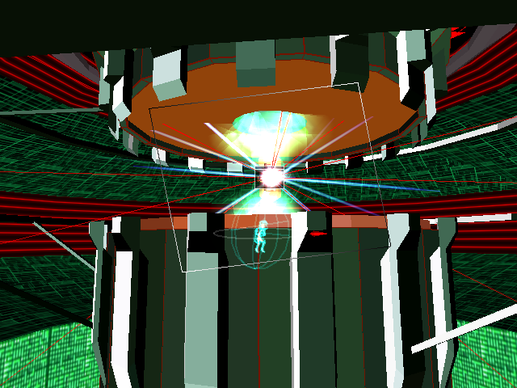

# Example #10C: Boss Types
The type of boss fight at the end of an area is based on the percentage of enemies shot down.  If the player shoots down less than 90% then they will fight the Mega boss, 98% to 90% is a Giga boss, and above 98% is the Tera boss.  The Tera version of the boss is the hardest to beat, followed by the Giga boss, making the Mega is easiest of the boss types.  To match their increased difficultly the Tera and Giga bosses give a bonus score when beat.  
 
 
## Homework #10
Pick any of bosses and make a challenge to beat the Giga or Tera version of that boss.
## Useful Memory
To complete the homework problem you’ll need the memory address: 
0x2003BC -> [32-bit] Boss Pointer (not null when boss is spawned) 
0x201270 -> [float] Boss Health (1.0 when full and 0.0 when dead) 

The four boss types string locations: 
0x3A3304 -> [ASCII] Mars Boss Type ("Mars[Mega]", "Mars[Giga]", and "Mars[Tera]") 
0x3A7794 -> [ASCII] Uranus Boss Type ("Uranus[Mega]", "Uranus[Giga]", and "Uranus[Tera]") 
0x3A91F8 -> [ASCII] Venus Boss Type ("Venus[Mega]", "Venus[Giga]", and "Venus[Tera]") 
0x3ADFF8 -> [ASCII] Earth Boss Type ("Earth[Mega]", "Earth[Giga]", and "Earth[Tera]") 
 
Solutions: [Tutorial #10 Solution](./Solution/readme.md) 
### Links
[Tutorial #10](readme.md) 
[Example #10A](Example_10A.md) 
[Example #10B](Example_10B.md) 
Example #10C