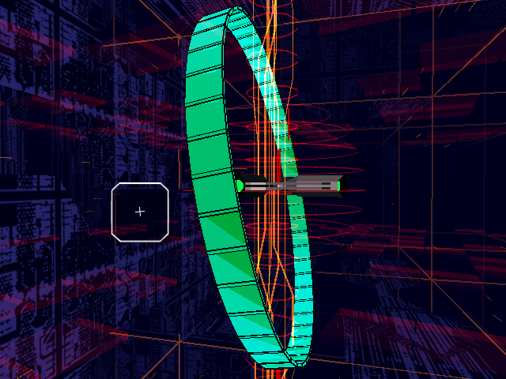

# Example #10C: Boss Types
The boss chosen for this example is beating the Tera Earth boss.  To fight this version of the Earth boss you need to shot down 98% or more of the enemies in Area 1. <br>
<br> 
```
// Rez
// #ID = 3419

// $2003BC: [32-bit] Boss Pointer (not null when boss is spawned)
function BossPointer() => tbyte(0x2003BC)

// $201248: [8-bit] Immortal Cheat (0 = off, 1 = on)
function ImmortalCheat() => byte(0x201248)

// $201250: [8-bit] Overdrive Cheat (0 = off, 1 = on)
function OverdriveCheat() => byte(0x201250)

// $201270: [float] Boss Health
function BossHealth() => float(0x201270)

// $210AC4: [24-bit] Game Pointer (null in menu)
function GamePointer() => tbyte(0x210AC4)

// $3ADFF8: [ASCII] Earth Boss Type ("Earth[Mega]","Earth[Giga]", and "Earth[Tera]")
function EarthBossType(offset = 0) => 0x3ADFF8 + offset

// $960094: [32-bit] Game Mode (0xFFFFFFFF when in game, otherwise in menu)
function GameMode() => dword(0x960094)

//-------------------------------------------------------------------------
// Hex array string definitions

// "Earth[Tera]" hex array string when fighting Tera Earth boss
EarthTera = [0x45,0x61,0x72,0x74,0x68,0x5B,0x54,0x65,0x72,0x61,0x5D]

//-------------------------------------------------------------------------
// Helper Functions

// Check if the string hex values equal the hex values at the passed address
function StringCompare(address, string)
{
    return all_of(range(0, length(string) - 1), i => byte(address + i) == string[i])
}

// Game state constant
InGame = 0xffffffff

// Challenges for the giga and tera bosses
function BossTypeChallenge(bossMemory, bossType)
{
    // Start when the player encounters the passed boss type
    start = once(
                ImmortalCheat() == 0 && 
                OverdriveCheat() == 0 && 
                GamePointer() != 0 &&
                StringCompare(bossMemory, bossType)
            )
    
    // Cancel on game over or exiting early
    cancel = never(
                prev(GameMode()) == InGame &&
                GameMode() != InGame
            )
    
    // Submit when the bosses health goess from above zero to zero or below
    submit = trigger_when(
                BossPointer() != 0 && 
                prev(BossHealth()) > 0.0 &&
                BossHealth() <= 0.0 
            )
            
    return start && cancel && submit
}

// Achievement for beating the Tera Earth Boss
achievement(
    "Tera Earth",
    "Defeat the Tera form Earth boss in Area 1",
    10,
    BossTypeChallenge(EarthBossType(), EarthTera)
)
```

## Start
The challenge starts when the “Earth[Tera]” string is detected, using the **StringCompare()** function, while the game pointer is active.  The achievement will not start if either immortal or infinite overdrive cheats are active.

## Cancel
The challenge cancels when the player dies or if the player exits the area.  This event is determined by when the game mode changes from the in game value of 0xffffffff to anything else.

## Submit
The challenge submits when the boss pointer is not null and the boss health values goes from above zero to zero or lower.  Note that when using the boss health to trigger events always check that the event does not occur if the player dies while the boss is almost dead.  Including the condition that the boss pointer must be active is protection against the challenge submitting if the boss health memory goes to zero for any other reason.<br>
<br>
[Complete Example #10C with the above solution](REZ_Example_10C.rascript)<br>
### Links
[Tutorial #10](../readme.md)<br>
[Example #10A](../Example_10A.md)<br>
[Example #10B](../Example_10B.md)<br>
[Example #10C](../Example_10C.md)