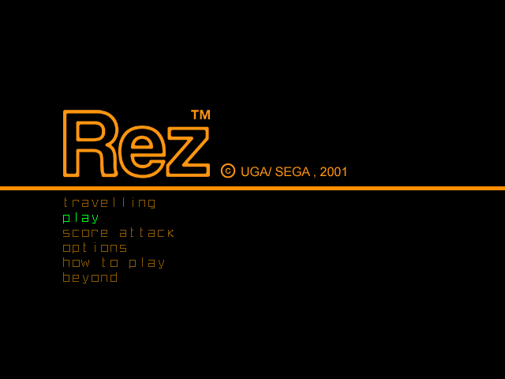

# Tutorial #10 – Strings
## Overview
This tutorial will show a few examples of how to create an achievement that uses strings.  The game [Rez](https://retroachievements.org/game/3419) was chosen for this tutorial because it is a rhythm based shoot ‘em up that uses strings for the currently loaded area and boss model. Another reason for picking Rez is that, like most disc based games, the GD-ROM itself has a name which can be used for identifying which region the player is using. 
 
 
## Strings
Strings are a sequenced array of values that represents text in a computer.  Each value in the array represents a character in the string and what value represents a character depends on the encoding.  The words you are reading right now are actually numeric values that the computer translates using an encoding standard, and then referencing a font table, prints the letters on the screen or on paper.
## Encodings 
There are many encoding standards that currently exist and the one we will be using in the tutorial is ASCII. When most retro games where developed ASCII was the main encoding standard however, newer games may use a different type of encoding so it is good to be aware that other encodings exists. Some more common encodings are:
### ASCII
[American Standard Code for Information Interchange (ASCII)](https://en.wikipedia.org/wiki/ASCII) was the industry standard for early personal computers. It define 128 different characters and uses a byte per character to keep the memory aligned with 8-bit architectures.  ASCII includes special characters used by printers and teletypewriters that will not be displayed on the screen.   The table below illustrates what the string “Hello World!” would look like as an ASCII string.  Note the zero at the end of the string, often strings are null terminated so the computer knows when the string array is done.  
| Index | 0 | 1 | 2 | 3 | 4 | 5 | 6 | 7 | 8 | 9 | 10 | 11 | 12 |
|:-:|:-:|:-:|:-:|:-:|:-:|:-:|:-:|:-:|:-:|:-:|:-:|:-:|:-:|
| Character | H | e | l | l | o |   | W | o | r | l | d | ! | **NULL** |
| Hex | 48 | 65 | 6c | 6c | 6f | 20 | 57 | 6f | 72 | 6c | 64 | 21 | 00 |

### Unicode
[Unicode (UTF)](https://en.wikipedia.org/wiki/Unicode) is the current encoding standard that modern computers use.  To keep the UTF backwards compatible with ASCII the first 128 characters are the same in both encodings. A UTF-8 string will look very similar to an ASCII string since it also uses a character per byte.  To support characters for all languages internationally, UTF-16 expanded the encoding definition to use 16 bits per character meaning a total possible 65,536 characters.  Other UTF standards exist however UTF-16 is the most common today since it can represent any language.  The table below illustrates what the string “Hello World!” would look like as an UFT-16 string.  Note that since the encoding is 16-bit, each index goes up by two instead of one like the ASCII encoding.  However, since the string is written with English characters the values are the same as ASCII values above with zeros padding the extra bits.
| Index | 0 | 2 | 4 | 6 | 8 | 10 | 12 | 14 | 16 | 18 | 20 | 22 | 24 |
|:-:|:-:|:-:|:-:|:-:|:-:|:-:|:-:|:-:|:-:|:-:|:-:|:-:|:-:|
| Character | H | e | l | l | o |   | W | o | r | l | d | ! | **NULL** |
| Hex | 0048 | 0065 | 006c | 006c | 006f | 0020 | 0057 | 006f | 0072 | 006c | 0064 | 0021 | 0000 |

### Links
Tutorial #10 
[Example #10A](Example_10A.md) 
[Example #10B](Example_10B.md) 
[Example #10C](Example_10C.md)