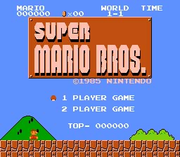

# Example #11A: Super Mario Bros.
The game selected for this example is [Super Mario Bros. (NES)](https://retroachievements.org/game/1446).  The reason why this game was selected is  because it is a well-known game and it was used as an example in the [RADocs](https://docs.retroachievements.org/Rich-Presence/).<br>
<br>
 
```
// Super Mario Bros.
// #ID = 1446

// $000E: Player's State:
function PlayerState() => byte(0x000e)

StatusLookup = {
    0: " [Loading]",
    1: " taking a vine warp",
    2: " entering a warp pipe",
    3: " entering a warp pipe",
    4: " ",
    5: " [Stage Complete]",
    6: " [Game Over]",
    7: " [Entering Area]",
    9: " growing",
    0xA: " shrinking",
    0xB: " ",
    0xC: " powering up",
}

// $0704: Can swim flag
function Swimming() => byte(0x000704)

SwimmingLookup = {
    1: " swimming",
}

// $0756: Set to 01 when large mario, 02 when fire-flower mario
function PowerUp() => byte(0x000756)

PowerupLookup = {
    0: "Small",
    1: "Super",
    2: "Fire",
}

// $075C: Act Number (0 based)
function Act() => byte(0x00075C)

// $075F: World (0 based)
function World() => byte(0x00075F)

// $075A: Mario Number of Lives, set to ff when game over
function Lives() => byte(0x00075A)

// $0770: Gameplay Mode, 00=demo/menu, 01=playing,
//        02=end of level
//        NB. Set to 02 and wait to advance a world
function GameplayMode() => byte(0x000770)

ModeLookup = {
    0: "[Demo] ",
    2: "[World Complete] ",
}

// $0776: Pause: 00=normal 81=pausing 01=paused 80=unpausing
function Pause() => byte(0x000776)

PausedLookup = {
    0x81: "▌▌ ",
    0x80: "▌▌ ",
    1: "▌▌ ",
}

// $079f: Invulnerability Counter: starts at 23, counts to 0, 0=normal
function StarCounter() => byte(0x00079F)
function StarBitcount() => bit0(0x00079F) + bit1(0x00079F) + bit2(0x00079F) + bit3(0x00079F) + bit4(0x00079F) + bit5(0x00079F)

StarLookup = {
    5: "🌟 ",
    4: "🌟 ",
    3: "🌟 ",
    2: "🌟 ",
    1: "🌟 ",
}

// $07FC: Second Quest enabled = 01
function SecondQuest() => byte(0x0007FC)

QuestLookup = {
    0x0: "1st",
    0x1: "2nd",
}

// Example #11A - Rich Presence for Super Mario Bros.
rich_presence_display("{0}{1}{2}{3} Mario in {4}-{5}{6}{7}, 🚶:{8}, {9} Quest",
    rich_presence_lookup("Mode", GameplayMode(), ModeLookup),
    rich_presence_lookup("Paused", Pause(), PausedLookup),
    rich_presence_lookup("Star", StarBitcount(), StarLookup),
    rich_presence_lookup("Powerup", PowerUp(), PowerupLookup),
    rich_presence_value("Digit", World() + 1),
    rich_presence_value("Digit", Act() + 1),
    rich_presence_lookup("Swimming", Swimming(), SwimmingLookup),
    rich_presence_lookup("Status", PlayerState(), StatusLookup),
    rich_presence_value("Digit", Lives() + 1),
    rich_presence_lookup("Quest", SecondQuest(), QuestLookup)
)

```
## rich_presence_display()
The ```rich_presence_display()``` function is used to define the default **Rich Presence**. It is used in a similar way to the format() function where the first parameter is the format string and the rest of the parameters are the values inserted into the format string. See the [RATools Wiki](https://github.com/Jamiras/RATools/wiki/Rich-Presence-Functions#rich_presence_displayformat_string-parameters) more information on ```rich_presence_display()```.

## {0} Mode
The ```ModeLookup``` has two different values.  If the memory accessor ```GameplayMode()``` is 0 then it displays “[Demo]” and if the value is 2 then it displays “[World Complete]”.  Any other values will result in an empty string.

## {1} Paused
The ```PausedLookup``` has three values for the same display output. If the memory accessor ```Pause()``` is 0x1, 0x80, or 0x80 then it displays the pause emoji. Any other values will result in an empty string.
## {2} Star Power
The ```StarLookup``` will display a star for any value between 1 to 5. The memory accessor ```StarBitcount()``` counts the first 5 bits of the byte and ignores the rest.  By counting the bits instead of using the raw values the ```StarLookup``` can be smaller since it only needs to have 5 possible values instead of 31.
## {3} Power Up
The ```PowerupLookup ``` has three values for each power state of  Mario. If the memory accessor ```PowerUp()``` is 0 then it displays “Small”, if Mario collects a mushroom the value is 1 then it displays “Super”, and when Mario collects a fire flower then it will display “Fire”   Any other values will result in an empty string.
## {4} World
The current world is zero based meaning that when Mario is in world 1 to memory accessor ```World()``` will be 0.  To display correctly we add 1 to the value of ```World()```.
## {5} Act 
Similar to the world, the current act is also zero based meaning that when Mario is in act 1 to memory accessor ```Act()``` will be 0.  We use the same technique to display correctly by adding 1 to the value of ```Act()```.
## {6} Swimming
The ```SwimmingLookup ``` only has one value defined.  If the memory accessor ```Swimming ()``` is 1 then it displays “swimming” otherwise an empty string will be displayed.
## {7} Status
The ```StatusLookup``` has 12 different definitions for the ```PlayerState()```memory accessor.  This memory is used for both the game state and the current state of Mario.  The state information is more useful for achievement code than **Rich Presence** however, it gives some additional context to what the player is currently doing.
## {8} Lives 
Like both the world and act, the current number of lives Mario has left is zero based meaning when Mario has 4 lives to memory accessor ```Lives()``` will be 3.  We use the same technique as the world and act to display the lives correctly by adding 1 to the value of ``` Lives()```.
## {9} Quest
The ```QuestLookup``` has two values defined for the current loop of the game. Super Mario Bros. is a game that has a second harder loop to play when you beat the final boss, Bowser, for the first time. If the memory accessor ```SecondQuest()``` is 0 then it displays “1st”and if the value is 1 then it displays “2nd”.  Any other values will result in an empty string.<br>
### Script
[Example #11A script](Example_11A.rascript) <br>
### Links
[Tutorial #11](readme.md) <br>
Example #11A<br>
[Example #11B](Example_11B.md) <br>
[Example #11C](Example_11C.md) <br>