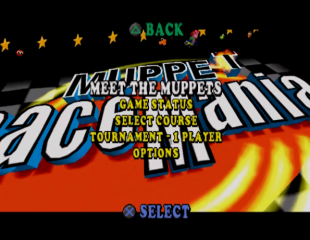

# Example #11B: Muppet RaceMania
The game [Muppet RaceMania](https://retroachievements.org/game/13910) was selected for this example because it has multiple regions linked to it. Each region has different memory locations so both the Rich Presence and Achievements need to have separate logic for each region supported.  Fortunately, RATools can help manage the memory differences and make equivalent logic for each region.<br>
<br>
 

```
// Muppet RaceMania
// #ID = 13910

// Give each language an unique value
EU = 0
FR = 1
DE = 2
IT = 3
ES = 4
US = 5

// Array of each supported language
Languages = [EU, FR, DE, IT, ES, US]

// $00b8b7: [ASCII] CD-ROM Name
//          SCES_020.01;1 = EU
//          SCES_024.83;1 = FR
//          SCES_024.84;1 = DE
//          SCES_024.85;1 = IT
//          SCES_024.86;1 = ES
//          SLUS_012.37;1 = US
function CDROM() => 0xb8b7

// "SCES_020.01;1" = EU Disc
EU_Disc = [0x53,0x43,0x45,0x53,0x5F,0x30,0x32,0x30,0x2E,0x30,0x38,0x3B,0x31]

// "SCES_024.83;1" = FR Disc
FR_Disc = [0x53,0x43,0x45,0x53,0x5F,0x30,0x32,0x34,0x2E,0x38,0x33,0x3B,0x31]

// "SCES_024.84;1" = DE Disc
DE_Disc = [0x53,0x43,0x45,0x53,0x5F,0x30,0x32,0x34,0x2E,0x38,0x34,0x3B,0x31]

// "SCES_024.85;1" = IT Disc
IT_Disc = [0x53,0x43,0x45,0x53,0x5F,0x30,0x32,0x34,0x2E,0x38,0x35,0x3B,0x31]

// "SCES_024.86;1" = ES Disc
ES_Disc = [0x53,0x43,0x45,0x53,0x5F,0x30,0x32,0x34,0x2E,0x38,0x36,0x3B,0x31]

// "SLUS_012.37;1" = US Disc
US_Disc = [0x53,0x4C,0x55,0x53,0x5F,0x30,0x31,0x32,0x2E,0x33,0x37,0x3B,0x31]    

// Dictionary of the disc names
Discs = {
    EU: EU_Disc,
    FR: FR_Disc,
    DE: DE_Disc,
    IT: IT_Disc,
    ES: ES_Disc,
    US: US_Disc
}

// 0xb0f38: Player's character (EU)
// 0xb0328: Personnage du joueur (fr)
// 0xb01dc: Spielercharakter (De)
// 0xb01ec: Personaggio dei giocatore (It)
// 0xb038c: Personaje del jugador (Es)
// 0xb07a4: Player's character (US)
PlayerCharacter = {
    EU: byte(0xb0f38),
    FR: byte(0xb0328),
    DE: byte(0xb01dc),
    IT: byte(0xb01ec),
    ES: byte(0xb038c),
    US: byte(0xb07a4)
}

// Dictionary of all the racers
Racers = {
    0: "Kermit",
    1: "Miss Piggy",
    2: "Gonzo",
    3: "Fozzie",    
    4: "Rizzo",
    5: "Beaker",
    6: "Rowlf",
    7: "Animal",
    8: "Janice",
    9: "Dr. Teeth",
    10: "Floyd",
    11: "Zoot",
    12: "Bunsen",
    13: "Chef",
    14: "Sam",
    15: "Scooter",
    16: "Pepe",
    17: "Bobo",
    18: "Link",
    19: "Robin",
    20: "Johnny Fiamma",
    21: "Sal",
    22: "Bean Bunny",
    23: "Clifford",
    24: "Doozer"
}

// 0xb0f3c: Player's vehicle (EU)
// 0xb032c: Véhicle du joueur (Fr)
// 0xb01e0: Spielerfahrzeug (De)
// 0xb01f0: Veicolo del giocatore (It)
// 0xb0390: Vehiculo del jugador (Es)
// 0xb07a8: Player's vehicle (US)
PlayerVehicle = {
    EU: byte(0xb0f3c),
    FR: byte(0xb032c),
    DE: byte(0xb01e0),
    IT: byte(0xb01f0),
    ES: byte(0xb0390),
    US: byte(0xb07a8)
}

// All the vehicles in the game
Vehicles = {
    0: "Racer",
    1: "Monster Truck",
    2: "Flying Saucer",
    3: "Bubbler",
    4: "Cheese",
    5: "Moon Buggy",
    6: "Bulldozer",
    7: "Dragster",
    8: "Love Bug",
    9: "Hotrod",
    10: "Spoetster",
    11: "Supercharger",
    12: "Hovercraft",
    13: "Hotdog",
    14: "Plane",
    15: "Dune Buggy",
    16: "Kart",
    17: "Water Buggy",
    18: "Spaceship",
    19: "Steamroller",
    20: "Speedster",
    21: "Flamer",
    22: "Snow Bike",
    23: "Trike",
    24: "Dumper"
}

// 0x0b1628: Current course set (EU)
// 0x0b0a18: Set de parcourses courante (Fr)
// 0x0b08d0: Aktuelle Set von Strecken (De)
// 0x0b08e0: Set di percorsi corrente (It)
// 0x0b0a80: Set de pistas actual (Es)
// 0x0b0e38: Current course set (US)
Set = {
    EU: byte(0x0b1628),
    FR: byte(0x0b0a18),
    DE: byte(0x0b08d0),
    IT: byte(0x0b08e0),
    ES: byte(0x0b0a80),
    US: byte(0x0b0e38)
}

// 0x0b1622: Current course (EU)
// 0x0b0a12: Parcours courante (Fr)
// 0x0b08ca: Aktuelle Strecke (De)
// 0x0b08da: Percorso corrente (It)
// 0x0b0a7a: Pista actual (Es)
// 0x0b0e32: Current course (US)
Course = {
    EU: byte(0x0b1622),
    FR: byte(0x0b0a12),
    DE: byte(0x0b08ca),
    IT: byte(0x0b08da),
    ES: byte(0x0b0a7a),
    US: byte(0x0b0e32)
}

// Dictionary of tracks are hashed by Set # * 16 + Course #
Tracks = {
    0x00: "Swamp",
    0x01: "Ghost Town",
    0x02: "Canyon",
    0x03: "Funfair",
    0x10: "Happiness Hotel",
    0x11: "Mallory Gallery",
    0x12: "Trafalgar Square",
    0x13: "Resturant",
    0x20: "Central Park",
    0x21: "New York City",
    0x22: "Theatre",
    0x23: "Diner",
    0x30: "Old London Town",
    0x31: "Graveyard",
    0x32: "Chamber",
    0x33: "Rooftops",
    0x40: "Dock",
    0x41: "Treasure Island",
    0x42: "Lagoon",
    0x43: "Mountain",
    0x50: "Secret Base",
    0x51: "Cape Doom",
    0x52: "Laboratory",
    0x53: "Muppet Labs",
    0x60: "Studio",
    0x61: "Arches",
    0x62: "Fraggle Rock",
    0x63: "Disco"
}

// 0x0c3e10: Player's race position (EU)
// 0x0c3158: Position du joueur (Fr)
// 0x0c3010: Platz im Rennen (De)
// 0x0c3020: Posizione del giocatore (It)
// 0x0c31c0: Posición del jugador (Es)
// 0x0c3572: Player's race position (US)
RacePosition = {
    EU: byte(0x0c3e10),
    FR: byte(0x0c3158),
    DE: byte(0x0c3010),
    IT: byte(0x0c3020),
    ES: byte(0x0c31c0),
    US: byte(0x0c3572)
}

// Dictionary of the place names for each position
Place = {
    1: "1st",
    2: "2nd",
    3: "3rd",
    4: "4th",
    5: "5th",
    6: "6th",
    7: "7th",
    8: "8th",
    9: "9th",
    10: "10th",
    11: "11th",
    12: "12th"
}

// Check if the string hex values equal the hex values at the passed address
function StringCompare(address, string)
{
    strArray = []
    for hexValue in string
    {
        array_push(strArray, byte(address) == hexValue)
        address = address + 1
    }
    return all_of(strArray, a => a)
}

// Make 25 example achievements using that support multiple languages
for index in range(0,24)
{
    // Setup the title and description of 
    title = Racers[index] + " " + Vehicles[index]
    description = "Select the racer " + Racers[index] + " with the vehicle " + Vehicles[index]
    triggers = []
        
    for language in Languages
    {
        // Make a condition to check the current language disc region and racer/vehicle combo
        array_push(triggers,
            StringCompare(CDROM(), Discs[language]) &&
            PlayerCharacter[language] == index &&
            PlayerVehicle[language] == index
        )
    }
    achievement(title, description, 0, any_of(triggers, t => t))
}

// Example #11B - Rich Presence the supports mulitple regions
for language in Languages
{
    disc = Discs[language]    
    rich_presence_conditional_display(
        StringCompare(CDROM(), disc) &&
            Set[language] != 0xff &&
            Course[language] != 0xff &&
            RacePosition[language] >= 1 && 
            RacePosition[language] <= 12, 
        "{0} is driving a {1} on the track {2} in {3} position!", 
        rich_presence_lookup("Racer", PlayerCharacter[language], Racers),
        rich_presence_lookup("Vehicle", PlayerVehicle[language], Vehicles),
        rich_presence_lookup("Track", Set[language] * 0x10 + Course[language], Tracks),
        rich_presence_lookup("Position", RacePosition[language], Place)
    )
}
rich_presence_display("The muppets are in the menu!")
```
## Using Dictionaries for Multiple Regions
Similar to the regional strings [Example #10A](.. /10_Strings/Example_10A.md) from the last tutorial we will be using the disc name to detect the region.  Memory accessors are defined using dictionaries instead of functions so that they can be looped through programmatically.  For example, instead of defining the ```PlayerCharacter()``` we store the accessor using the language as the key.  To access the North American memory use the command ```PlayerCharacter[US]```.  The rational for setting up the memory like this is that you can create alts using the same basic logic.  Note that each language is a unique value and the array ```Languages``` contains all of the supported language values.

Included in the above code is a silly example of how to create achievements using dictionaries.  The achievements are to check if the racer has selected a certain vehicle.  The dictionaries we defined for the rich presence is also used here to build the title and description. The logic for each alt is essentially the same except for the part that checks the disc name.  The nice thing about coding an achievement like this is only one alt is ever active at a time.

## rich_presence_conditional_display()
In this example we used the command [rich_presence_conditional_display](https://github.com/Jamiras/RATools/wiki/Rich-Presence-Functions#rich_presence_conditional_displaycondition-format_string-parameters) to control what message is displayed depending on the disc name.  Each message format is exactly the same and the code will fill in the correct memory address for the region.  Remember that order matters when using the conditional display and it will display the string for the first condition that is met even if later conditions would also be true.

## {0} Racer
The ```Racers ``` lookup has all 25 possible racers defined.  The memory accessor ```PlayerCharacter[]``` has a one to one match for the values in the lookup.

## {1} Vehicle 
The ```Vehicles ``` lookup has all 25 possible vehicles defined.  Like the Racer, the memory accessor ```PlayerVehicle[]``` has a one to one match for the values in the lookup.

## {2} Track 
The ```Tracks ``` lookup has all 24 possible tracks defined.  This value is a composite value of the ```Set[]``` and ```Course[]``` accessors. By combining these values together we  can define all of the tracks in one lookup.  Note that the value of ```Set[]``` is multiplied by 16 to ensure each track value is unique.  The multiplier 16 was chose since in hex the ```Course[]``` would be the lower four bits and ```Set[]``` would be the upper four bits. Other multipliers could be used so long as the possible combinations all yield unique results.

## {3} Position 
The ```Place``` lookup has all 12 possible race placements defined.  Like the Racer and Vehicle, the memory accessor ```RacePosition[]``` has a one to one match for the values in the lookup.  Cardinal values (1, 2, …, 12) could be displayed directly however, a dictionary was chosen to display the ordinal values (1st, 2nd, …, 12th) instead.
### Script
Scripts: [Example #11B script](Example_11B.rascript)<br>
### Links
[Tutorial #11](readme.md) <br>
[Example #11A](Example_11A.md) <br>
Example #11B <br>
[Example #11C](Example_11C.md)