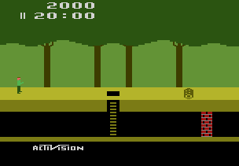

# Example #11C: Pitfall! Revisited
The game [Pitfall!](https://retroachievements.org/game/11191) was selected for this homework example since most of the values require arithmicatic operations to display correctly.  Pitfall! was covered in [Tutorial #4 – Arithmetic Operations](../04_Arithmetic_Operations/readme.md) if you would like a refresher on the game.<br>
<br>
## Homework #11
Create a Rich Presence for a Pitfall! using the format: ``` "⏳{0} | 💳{1}/32 | 🧑x{2} | 💯{3}" ```` <br>
Where {0} is time, {1} is treasures obtained, {2} is lives, and {3} is score.
## Useful Memory
To complete the homework problem you’ll need the memory addresses:<br>
0x0000 -> [8-bit] Lives,  bit5=1st extra life,  bit7=2nd extra life <br>
0x001E -> [8-bit] 00=game active <br> 
0x0055 -> [BCD] Score XX0000 <br>
0x0056 -> [BCD] Score 00XX00 <br>
0x0057 -> [BCD] Score 0000XX <br>
0x0058 -> [BCD] Time XX:00 <br>
0x0059 -> [BCD] Time 00:XX <br>
0x005A -> [8-bit] Time (milliseconds) <br>
0x006D -> [8-bit] Treasures flags 1-8 <br>
0x006E -> [8-bit] Treasures flags 9-16 <br>
0x006F -> [8-bit] Treasures flags 17-24 <br>
0x0070 -> [8-bit] Treasures flags 25-32 <br>
<br>
Solutions: [Tutorial #11 Solution](./Solution/readme.md)<br>
### Links
[Tutorial #11](readme.md)<br>
[Example #11A](Example_11A.md)<br>
[Example #11B](Example_11B.md)<br>
Example #11C